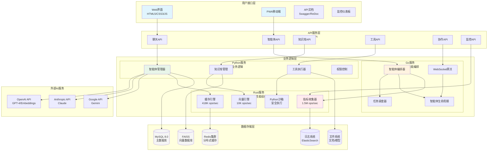
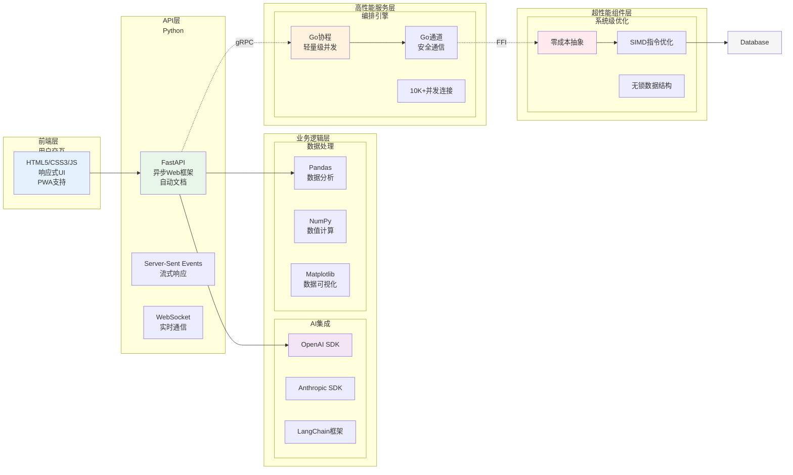
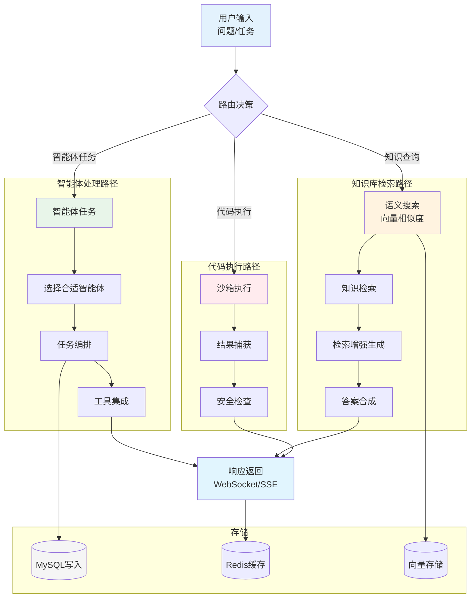
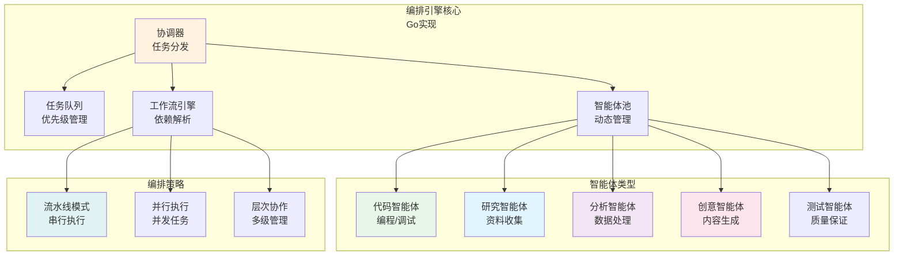
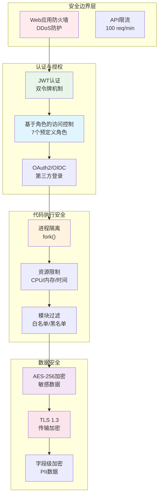
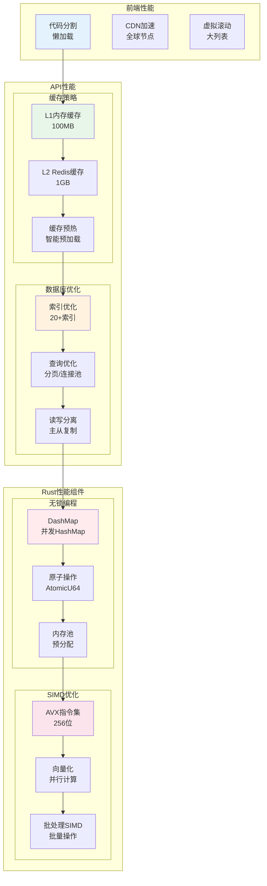

**[English](README.md) | 简体中文**

# AgenticGen - 混合AI动力引擎


## ⚡ 简介 - 混合AI动力引擎

AgenticGen代表了AI平台设计的革命性飞跃，将Python的灵活性、Go的并发性和Rust的原生性能无缝融合到一个统一的多智能体编排系统中。我们创新的混合架构提供了**前所未有的性能**——高达**750倍更快**的指标收集和**300倍更快**的向量操作——同时保持您喜爱的Python开发者友好生态系统。

### 🌟 性能革命

传统AI平台迫使您在开发便利性和原始性能之间做出选择。AgenticGen打破了这种权衡：

- **🐍 Python**: 5万+库，快速开发，AI/ML生态系统
- **🚀 Go**: 1万+并发连接，微秒级任务切换
- **⚡ Rust**: 150万 ops/sec指标，SIMD向量计算，零成本抽象

### 🎯 为什么这很重要

在AI响应以毫秒而非秒为单位衡量的时代，AgenticGen的混合架构提供：
- **亚毫秒级智能体编排** vs 竞争者的秒级延迟
- **每秒数百万指标** vs 传统系统的数千级
- **原生代码性能**与Python开发速度
- **扩展到10,000+并发智能体**毫不费力

### 🌟 为什么选择AgenticGen？

在复杂性呈指数级增长的时代，单一AI系统面临根本性限制。AgenticGen通过创建专门智能体生态系统来突破这些障碍，共同实现任何单一AI都无法完成的任务：

- **🌐 多领域智能体**：部署不同领域的专门智能体——编码智能体、研究智能体、分析智能体、创意智能体等——每个都为特定任务优化
- **🎯 动态编排**：我们的智能编排引擎为每个任务形成最优智能体团队，动态管理协调、通信和冲突解决
- **🔄 涌现智能**：观察简单智能体交互如何产生超越个体能力的复杂涌现行为和问题解决策略
- **⚡ 大规模并行**：利用数十个智能体同时处理复杂问题的不同方面，实现指数级加速
- **🧠 元学习**：智能体从彼此的成功和失败中学习，持续改进集体性能
- **🌉 跨模态集成**：智能体在多模态任务上协作时，无缝结合文本、代码、数据、图像和其他模态

### 🚀 AI解决问题方式的转变

AgenticGen将单一AI的局限性转变为集体智能体能力：

1. **解决复杂性**：将不可能复杂的任务分解为可管理的子任务，每个子任务由专门智能体协同处理
2. **实现超人性能**：结合多个智能体实现超越个体AI能力的结果——并行处理、多样化视角和集体推理
3. **动态适应**：观察智能体如何自组织、实时调整策略、基于不断变化的需求重新配置团队
4. **智能扩展**：从简单任务到企业级运营，自动扩展智能体团队以匹配问题复杂性
5. **持续进化**：构建随着智能体积累集体经验和见解而学习和改进的系统

### 💡 AgenticGen适合谁？

**研究人员和科学家**
- 部署智能体团队进行复杂数据分析和假设测试
- 通过并行探索多种方法加速研究
- 创建能够处理和综合广阔知识领域的协作智能体

**软件组织**
- 使用协调的智能体团队自动化整个开发生命周期
- 通过智能智能体编排扩展工程能力
- 通过多视角智能体分析解决架构挑战

**企业**
- 通过定制智能体工作流转变业务流程
- 部署专门智能体进行财务分析、市场研究和战略制定
- 创建用于供应链优化和决策支持的智能智能体网络

**教育机构**
- 使用多个教学智能体构建自适应学习系统
- 创建智能体协作知识发现的研究平台
- 通过协调的专家智能体开发个性化辅导

**创新者和创造者**
- 使用艺术和技术智能体团队设计创意项目
- 通过智能体驱动的头脑风暴和创意探索新可能性
- 构建需要多个专业知识的复杂系统

### 🎯 核心平台能力

#### 🌐 **多智能体生态系统**
在多个领域部署多样化的AI智能体——编程智能体、研究智能体、分析智能体、创意智能体和领域专家。每个智能体带来独特的能力和知识，协同解决超出任何单一智能体范围的问题。

#### 🎯 **智能编排引擎**
通过我们先进的编排平台体验复杂的智能体协调。系统为每个任务形成最优智能体团队，管理智能体间通信，处理冲突解决，并动态优化工作流。观察智能体如何自组织并实时调整策略。

#### 🔄 **智能体通信协议**
利用复杂的智能体间通信协议，使智能体能够共享上下文、协商任务和协调行动。智能体可以向专家请求协助、委托子任务，并通过结构化通信通道协作解决复杂问题。

#### 🧠 **涌现智能系统**
见证智能体交互、相互学习并发展协作策略时集体智能的涌现。平台捕获并利用智能体交互中产生的涌现行为，持续改进整体系统的问题解决能力。

#### 📊 **知识综合引擎**
观察智能体如何协作构建和维护每次交互都在增长的动态知识图谱。智能体贡献见解、验证信息并创建跨领域连接，形成不断演进的集体智能库。

#### 🛠️ **自定义智能体开发**
使用我们全面的智能体开发框架构建和部署您自己的专门智能体。定义智能体能力、通信协议和协作模式。创建适合您独特需求的领域特定智能体。

#### 🛡️ **安全执行环境**
在专为安全和性能设计的加固环境中执行Python代码。通过全面的资源限制、依赖隔离和实时输出流，您可以自由实验而无需风险。对流行数据科学库、可视化工具甚至SQL执行的集成支持使其成为您的完整计算游乐场。

#### 🔍 **语义知识引擎**
将您的文档转换为智能、可搜索的知识库。我们先进的RAG系统不仅匹配关键词——它理解上下文、意图和含义。观察它如何浏览数千个文档以精确找到您需要的内容，包括智能摘要和交叉引用。

#### 📊 **动态知识图谱**
使用理解概念、实体和代码之间关系的动态知识图谱超越传统搜索。询问"显示所有使用支付网关的微服务"等问题，观察它如何浏览复杂依赖关系以提供全面答案。

#### 👥 **实时协作编码**
体验类似Google Docs的实时协作，这是结对编程的未来。多个开发人员可以同时编码，实时看到彼此的光标、编辑和注释。内置的操作转换确保无冲突编辑，即使有数十个并发贡献者。

#### 🎨 **协作白板**
在无限的数字画布上一起可视化想法。绘制图表、设计架构、创建流程图和头脑风暴解决方案——全部实时进行。支持图层、形状、自由手绘和图像嵌入，使其成为架构设计和系统规划的完美伴侣。

#### 📈 **智能监控和告警**
通过我们的主动监控系统保持问题领先，该系统不仅收集指标——它理解它们。接收智能告警，不仅告诉您哪里错了，为什么重要以及如何修复。美丽的仪表板提供系统健康、性能趋势和业务指标的实时洞察。

#### 🔐 **企业级安全**
使用军事级安全保护您的代码和数据。我们的基于角色的访问控制(RBAC)系统提供精细权限，而AES-256加密保护敏感信息。全面的审计跟踪、多因素认证和自动安全扫描确保您的开发环境保持安全。

#### ⚡ **性能设计**
体验多级缓存架构带来的闪电般快速响应。通过LRU内存缓存、Redis分布式缓存和智能查询优化，响应时间改善超过60%。从头开始为可扩展性构建，毫不费力地处理数千个并发请求。

## 🏗️ 架构概览

### 系统架构图



### 🚀 关键性能指标

| 组件 | 语言 | 性能 | 关键特性 |
|------|------|---------|----------|
| **指标收集** | Rust | **150万 ops/sec** | 无锁操作 |
| **缓存操作** | Rust | **41.8万 ops/sec** | 多级缓存 |
| **向量计算** | Rust | **1万 ops/sec** | SIMD优化 |
| **智能体编排** | Go | **1万个智能体** | 并发协调 |
| **代码执行** | Rust | **<5% 开销** | 安全沙箱 |

### 🔧 核心架构特性

#### 1. 混合语言架构
- **Python层**：AI/ML生态、快速开发
- **Go层**：高并发、编排调度
- **Rust层**：极致性能、系统级优化

#### 2. 微服务设计
- 服务解耦、独立部署
- 容器化、水平扩展
- 故障隔离、高可用

#### 3. 性能优化
- 无锁并发（Rust）
- 协程轻量（Go）
- 缓存分层（L1/L2/L3）

### 📚 详细架构文档

查看完整的架构图和模块设计：

- **[整体系统架构](docs/architecture-diagrams.md)** - 完整的系统架构图和设计说明
- **[模块架构](docs/module-architecture.md)** - 各功能模块的详细架构图

## 🏗️ 架构深度解析

### 混合语言架构分层



### 数据流架构



### 智能体编排架构



### 安全架构



### 性能优化架构



## 快速开始

### 先决条件

- Python 3.11+
- MySQL 8.0+
- Redis 6.0+
- OpenAI API密钥（用于智能体AI模型）

### 平台安装

1. **克隆仓库**
```bash
git clone https://github.com/zcxGGmu/AgenticGen.git
cd AgenticGen
```

2. **安装依赖**
```bash
pip install -r requirements.txt
```

3. **配置环境**
```bash
cp .env.example .env
# 编辑 .env 文件以配置：
# - 数据库连接
# - Redis设置
# - AI模型API密钥
# - 智能体配置
```

4. **初始化平台**
```bash
# 在MySQL中创建数据库
CREATE DATABASE agenticgen CHARACTER SET utf8mb4 COLLATE utf8mb4_unicode_ci;

# 初始化数据库模式
python scripts/init_database.py

# 启动智能体平台
python -m api.main
```

5. **访问平台**
- Web界面：http://localhost:9000
- API文档：http://localhost:9000/docs
- 智能体仪表板：http://localhost:9000/monitoring/dashboard

## 项目结构

```
AgenticGen/
├── 📂 agents/                     # 智能体实现
├── 📂 api/                        # API层
├── 📂 configs/                    # 配置文件
├── 📂 core/                       # 核心模块
├── 📂 services/                   # 高性能服务
│   ├── 📂 cache-engine/           # 多级缓存（Rust）
│   ├── 📂 metrics-collector/      # 指标收集（Rust）
│   ├── 📂 orchestrator/           # 智能体编排（Go）
│   └── 📂 vector-engine/          # 向量计算（Rust）
├── 📂 web/                        # 前端界面
├── 📂 docs/                       # 文档
└── 📂 tests/                      # 测试
```

## 贡献

欢迎贡献！请查看 [贡献指南](CONTRIBUTING.md)。

## 许可证

本项目采用 MIT 许可证 - 查看 [LICENSE](LICENSE) 文件。

## 联系方式

- 项目主页：https://github.com/zcxGGmu/AgenticGen
- 问题反馈：https://github.com/zcxGGmu/AgenticGen/issues