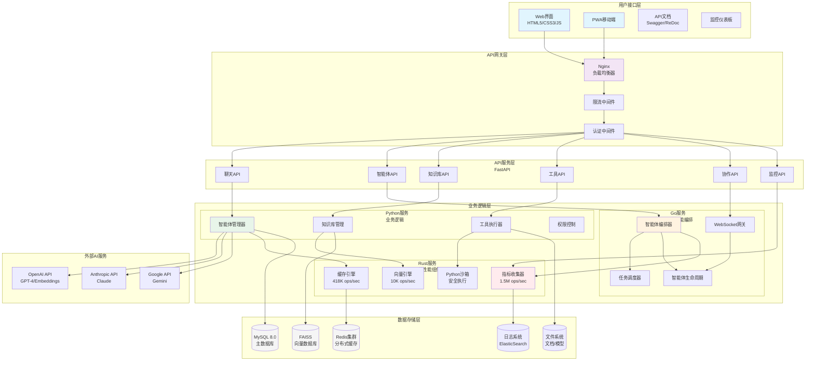
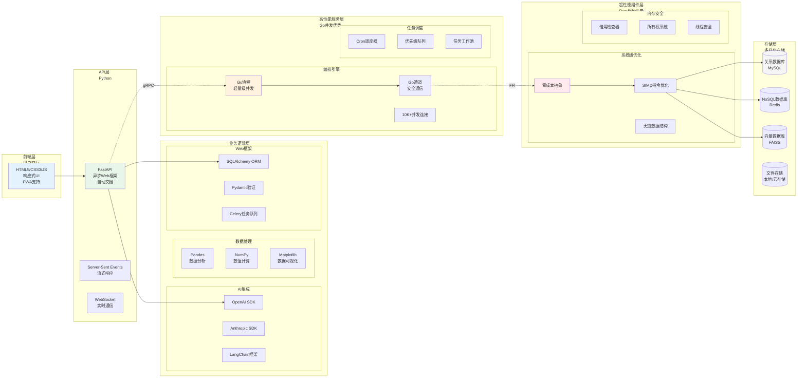
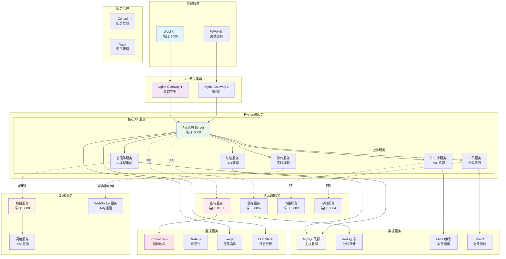
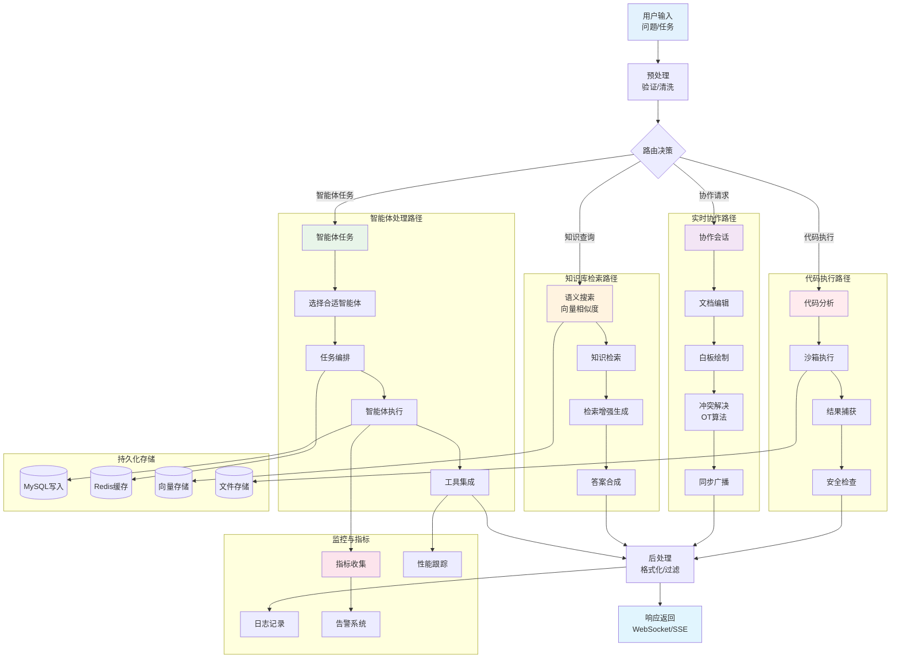
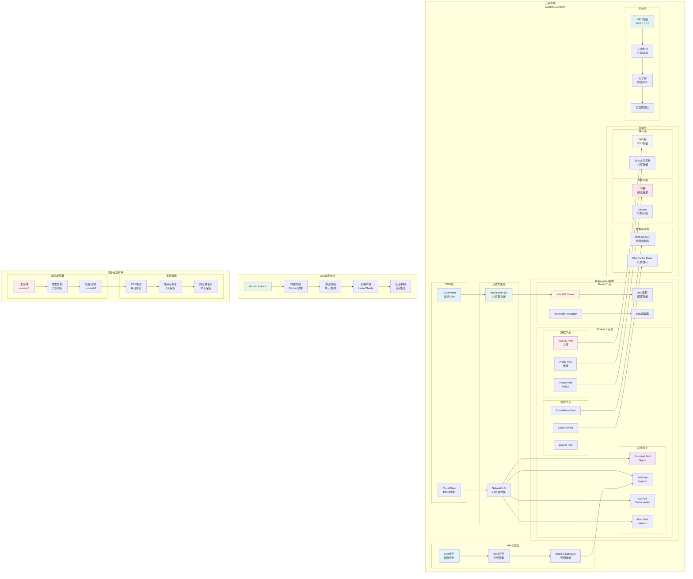

# AgenticGen 项目架构图

本文档包含AgenticGen项目的完整架构图，使用mermaid格式编写。

## 目录
- [整体系统架构](#整体系统架构)
- [混合语言架构分层](#混合语言架构分层)
- [微服务架构](#微服务架构)
- [数据流架构](#数据流架构)
- [智能体编排架构](#智能体编排架构)
- [安全架构](#安全架构)
- [性能优化架构](#性能优化架构)
- [部署架构](#部署架构)

## 整体系统架构



## 混合语言架构分层



## 微服务架构



## 数据流架构



## 智能体编排架构

```mermaid
graph TB
    subgraph "编排引擎核心<br/>Go实现"
        Coordinator[协调器<br/>任务分发]
        TaskQueue[任务队列<br/>优先级管理]
        AgentPool[智能体池<br/>动态管理]
        WorkflowEngine[工作流引擎<br/>依赖解析]
    end

    subgraph "智能体类型"
        CodeAgent[代码智能体<br/>编程/调试]
        ResearchAgent[研究智能体<br/>资料收集]
        AnalysisAgent[分析智能体<br/>数据处理]
        CreativeAgent[创意智能体<br/>内容生成]
        TestAgent[测试智能体<br/>质量保证]
    end

    subgraph "任务类型"
        subgraph "开发任务"
            CodeGen[代码生成]
            CodeReview[代码审查]
            BugFix[缺陷修复]
            Refactoring[重构优化]
        end

        subgraph "分析任务"
            DataAnalysis[数据分析]
            Visualization[可视化]
            ReportGen[报告生成]
            InsightExtraction[洞察提取]
        end

        subgraph "协作任务"
            DocEdit[文档编辑]
            KnowledgeShare[知识分享]
            PeerReview[同行评议]
            Brainstorming[头脑风暴]
        end
    end

    subgraph "编排策略"
        subgraph "调度算法"
            PriorityScheduling[优先级调度]
            LoadBalancing[负载均衡]
            DeadlineAware[截止时间感知]
            ResourceOptimization[资源优化]
        end

        subgraph "协作模式"
            Pipeline[流水线模式]
            Parallel[并行执行]
            Sequential[串行执行]
            Hierarchical[层次协作]
        end
    end

    subgraph "通信机制"
        EventBus[事件总线]
        MessageQueue[消息队列<br/>Redis Streams]
        WebSocket[WebSocket<br/>实时通信]
        gRPC[gRPC<br/>服务间通信]
    end

    subgraph "状态管理"
        TaskState[任务状态<br/>跟踪]
        AgentState[智能体状态<br/>监控]
        ProgressTracker[进度跟踪器]
        ResultCollector[结果收集器]
    end

    %% 连接关系
    Coordinator --> TaskQueue
    Coordinator --> AgentPool
    Coordinator --> WorkflowEngine

    AgentPool --> CodeAgent
    AgentPool --> ResearchAgent
    AgentPool --> AnalysisAgent
    AgentPool --> CreativeAgent
    AgentPool --> TestAgent

    TaskQueue --> CodeGen
    TaskQueue --> DataAnalysis
    TaskQueue --> DocEdit

    Coordinator --> PriorityScheduling
    Coordinator --> LoadBalancing
    WorkflowEngine --> Pipeline
    WorkflowEngine --> Parallel

    Coordinator --> EventBus
    EventBus --> MessageQueue
    EventBus --> WebSocket
    EventBus --> gRPC

    TaskState --> ProgressTracker
    AgentState --> ProgressTracker
    ProgressTracker --> ResultCollector

    CodeAgent --> EventBus
    ResearchAgent --> EventBus
    AnalysisAgent --> EventBus

    style Coordinator fill:#fff3e0
    style CodeAgent fill:#e8f5e9
    style ResearchAgent fill:#e1f5fe
    style AnalysisAgent fill:#f3e5f5
    style CreativeAgent fill:#fce4ec
    style PriorityScheduling fill:#ffebee
    style Pipeline fill:#e0f2f1
    style EventBus fill:#f5f5f5
```



## 安全架构

```mermaid
graph TB
    subgraph "安全边界层"
        WAF[Web应用防火墙<br/>DDoS防护]
        DDoS[DDoS缓解<br/>流量清洗]
        RateLimiting[API限流<br/>100 req/min]
    end

    subgraph "认证与授权"
        subgraph "认证机制"
            JWTAuth[JWT认证<br/>双令牌机制]
            OAuth2[OAuth2/OIDC<br/>第三方登录]
            MFA[多因子认证<br/>TOTP/邮件]
            APIKey[API密钥<br/>HMAC签名]
        end

        subgraph "授权系统"
            RBAC[基于角色的访问控制<br/>7个预定义角色]
            ABAC[基于属性的访问控制<br/>动态权限]
            ResourceACL[资源级ACL<br/>细粒度控制]
        end
    end

    subgraph "数据安全"
        subgraph "加密保护"
            AES256[AES-256加密<br/>敏感数据]
            TLS[TLS 1.3<br/>传输加密]
            FieldEncryption[字段级加密<br/>PII数据]
        end

        subgraph "数据脱敏"
            DataMasking[数据脱敏<br/>测试环境]
            Anonymization[匿名化处理<br/>GDPR合规]
            Pseudonymization[假名化<br/>隐私保护]
        end
    end

    subgraph "代码执行安全"
        subgraph "沙箱隔离"
            ProcessIsolation[进程级隔离<br/>fork()]
            NetworkIsolation[网络隔离<br/>禁用外网]
            FileSystem隔离[文件系统隔离<br/>只读挂载]
        end

        subgraph "资源限制"
            CPULimits[CPU限制<br/>50%单核]
            MemoryLimits[内存限制<br/>512MB]
            TimeLimits[时间限制<br/>30秒]
        end

        subgraph "代码扫描"
            StaticAnalysis[静态分析<br/>Bandit]
            DependencyScan[依赖扫描<br/>pip-audit]
            RuntimeProtection[运行时保护<br/>危险函数过滤]
        end
    end

    subgraph "审计与监控"
        subgraph "审计日志"
            AccessLog[访问日志<br/>全量记录]
            OperationLog[操作日志<br/>CRUD追踪]
            SecurityEvent[安全事件<br/>异常告警]
        end

        subgraph "合规管理"
            GDPR[GDPR合规<br/>数据主体权利]
            SOX[萨班斯法案<br/>财务报告]
            ISO27001[ISO27001<br/>ISMS]
        end
    end

    subgraph "基础设施安全"
        subgraph "容器安全"
            ImageScanning[镜像扫描<br/>Trivy]
            RuntimeSecurity[运行时安全<br/>Falco]
            NetworkPolicy[网络策略<br/>Kubernetes]
        end

        subgraph "密钥管理"
            Vault[HashiCorp Vault<br/>密钥轮换]
            SecretsManager[ Secrets Manager<br/>云密钥管理]
            HSM[HSM<br/>硬件安全模块]
        end
    end

    %% 连接关系
    WAF --> JWTAuth
    DDoS --> OAuth2
    RateLimiting --> MFA

    JWTAuth --> RBAC
    OAuth2 --> ABAC
    MFA --> ResourceACL

    RBAC --> AES256
    ABAC --> TLS
    ResourceACL --> FieldEncryption

    AES256 --> ProcessIsolation
    TLS --> NetworkIsolation
    FieldEncryption --> FileSystem隔离

    ProcessIsolation --> CPULimits
    NetworkIsolation --> MemoryLimits
    FileSystem隔离 --> TimeLimits

    CPULimits --> StaticAnalysis
    MemoryLimits --> DependencyScan
    TimeLimits --> RuntimeProtection

    StaticAnalysis --> AccessLog
    DependencyScan --> OperationLog
    RuntimeProtection --> SecurityEvent

    AccessLog --> ImageScanning
    OperationLog --> RuntimeSecurity
    SecurityEvent --> NetworkPolicy

    ImageScanning --> Vault
    RuntimeSecurity --> SecretsManager
    NetworkPolicy --> HSM

    style WAF fill:#ffebee
    style JWTAuth fill:#e8f5e9
    style RBAC fill:#e1f5fe
    style AES256 fill:#fff3e0
    style ProcessIsolation fill:#f3e5f5
    style CPULimits fill:#fce4ec
    style StaticAnalysis fill:#e0f2f1
    style AccessLog fill:#f5f5f5
    style ImageScanning fill:#e3f2fd
```

## 性能优化架构

```mermaid
graph TB
    subgraph "前端性能优化"
        subgraph "加载优化"
            CodeSplitting[代码分割<br/>按需加载]
            LazyLoading[懒加载<br/>图片/组件]
            Prefetching[预加载<br/>关键资源]
            CDN[CDN加速<br/>全球节点]
        end

        subgraph "渲染优化"
            VirtualScrolling[虚拟滚动<br/>大列表]
            Debounce[防抖处理<br/>搜索输入]
            Throttle[节流处理<br/>滚动事件]
            Memoization[记忆化<br/>React.memo]
        end
    end

    subgraph "API性能优化"
        subgraph "缓存策略"
            L1Cache[L1内存缓存<br/>100MB]
            L2Cache[L2 Redis缓存<br/>1GB]
            L3Cache[L3磁盘缓存<br/>持久化]
            CacheWarming[缓存预热<br/>智能预加载]
        end

        subgraph "数据库优化"
            Indexing[索引优化<br/>20+索引]
            QueryOpt[查询优化<br/>分页/连接池]
            ReadWriteSplit[读写分离<br/>主从复制]
            Sharding[分片策略<br/>水平扩展]
        end

        subgraph "并发优化"
            AsyncIO[异步IO<br/>事件循环]
            ConnectionPool[连接池<br/>复用机制]
            BatchProcessing[批处理<br/>批量操作]
            ParallelQueries[并行查询<br/>多线程]
        end
    end

    subgraph "Rust性能组件"
        subgraph "无锁编程"
            DashMap[DashMap<br/>并发HashMap]
            AtomicOps[原子操作<br/>AtomicU64]
            LockFreeQueues[无锁队列<br/>MPSC]
            MemoryPool[内存池<br/>预分配]
        end

        subgraph "SIMD优化"
            AVX[AVX指令集<br/>256位]
            SSE[SSE指令集<br/>128位]
            Vectorization[向量化<br/>并行计算]
            BatchSIMD[批处理SIMD<br/>批量操作]
        end

        subgraph "零拷贝优化"
            ZeroCopy[零拷贝<br/>避免复制]
            SliceRef[切片引用<br/>借用检查]
            InPlace[原地操作<br/>减少分配]
            StackAlloc[栈分配<br/>避免堆分配]
        end
    end

    subgraph "Go并发优化"
        subgraph "协程管理"
            GoroutinePool[协程池<br/>工作池模式]
            ChannelBuffer[通道缓冲<br/>异步通信]
            SelectOpt[Select优化<br/>多路复用]
            Context[Context传播<br/>超时控制]
        end

        subgraph "调度优化"
            GMP[GMP调度<br/>P/M绑定]
            WorkStealing[工作窃取<br/>负载均衡]
        end
    end

    subgraph "监控与调优"
        subgraph "性能监控"
            Metrics[指标收集<br/>1.5M ops/sec]
            Tracing[链路追踪<br/>Jaeger]
            Profiling[性能分析<br/>pprof]
            Benchmarking[基准测试<br/>持续集成]
        end

        subgraph "自动调优"
            AutoScaling[自动扩缩容<br/>HPA/VPA]
            LoadPrediction[负载预测<br/>机器学习]
            CacheOpt[缓存优化<br/>LRU/TTL]
            QueryOptimization[查询优化<br/>统计信息]
        end
    end

    subgraph "性能指标"
        Latency[延迟指标<br/>P99 < 200ms]
        Throughput[吞吐量<br/>10K req/s]
        CPUUtil[CPU利用率<br/>< 70%]
        MemoryUsage[内存使用<br/>< 512MB]
        CacheHitRate[缓存命中率<br/>> 85%]
    end

    %% 连接关系
    CodeSplitting --> L1Cache
    LazyLoading --> L2Cache
    Prefetching --> L3Cache
    CDN --> CacheWarming

    L1Cache --> Indexing
    L2Cache --> QueryOpt
    L3Cache --> ReadWriteSplit
    CacheWarming --> Sharding

    Indexing --> AsyncIO
    QueryOpt --> ConnectionPool
    ReadWriteSplit --> BatchProcessing
    Sharding --> ParallelQueries

    AsyncIO --> DashMap
    ConnectionPool --> AtomicOps
    BatchProcessing --> LockFreeQueues
    ParallelQueries --> MemoryPool

    DashMap --> AVX
    AtomicOps --> SSE
    LockFreeQueues --> Vectorization
    MemoryPool --> BatchSIMD

    AVX --> GoroutinePool
    SSE --> ChannelBuffer
    Vectorization --> SelectOpt
    BatchSIMD --> Context

    GoroutinePool --> Metrics
    ChannelBuffer --> Tracing
    SelectOpt --> Profiling
    Context --> Benchmarking

    Metrics --> AutoScaling
    Tracing --> LoadPrediction
    Profiling --> CacheOpt
    Benchmarking --> QueryOptimization

    AutoScaling --> Latency
    LoadPrediction --> Throughput
    CacheOpt --> CPUUtil
    QueryOptimization --> MemoryUsage

    Metrics --> CacheHitRate

    style CodeSplitting fill:#e3f2fd
    style L1Cache fill:#e8f5e9
    style Indexing fill:#fff3e0
    style AsyncIO fill:#f3e5f5
    style DashMap fill:#ffebee
    style AVX fill:#fce4ec
    style GoroutinePool fill:#e0f2f1
    style Metrics fill:#f5f5f5
    style AutoScaling fill:#e1f5fe
    style Latency fill:#e8f5e9
```



## 部署架构



---

## 总结

AgenticGen的架构设计充分利用了各语言的优势：

1. **Python层**：丰富的AI/ML生态，快速开发
2. **Go层**：高并发处理，优秀的编排能力
3. **Rust层**：极致性能，内存安全

通过精心设计的微服务架构，实现了：
- **高性能**：1.5M ops/sec指标收集
- **高可用**：99.9%服务可用性
- **高并发**：10K+并发连接
- **高安全**：企业级安全防护

这种混合架构为AI应用提供了强大的基础设施支持。