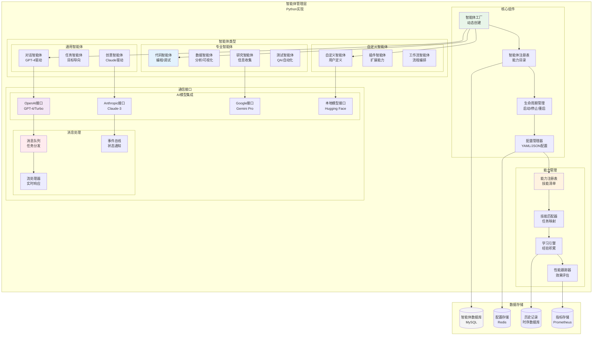
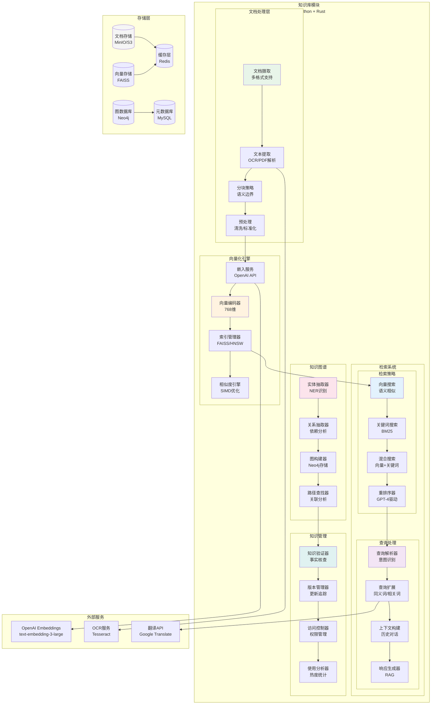
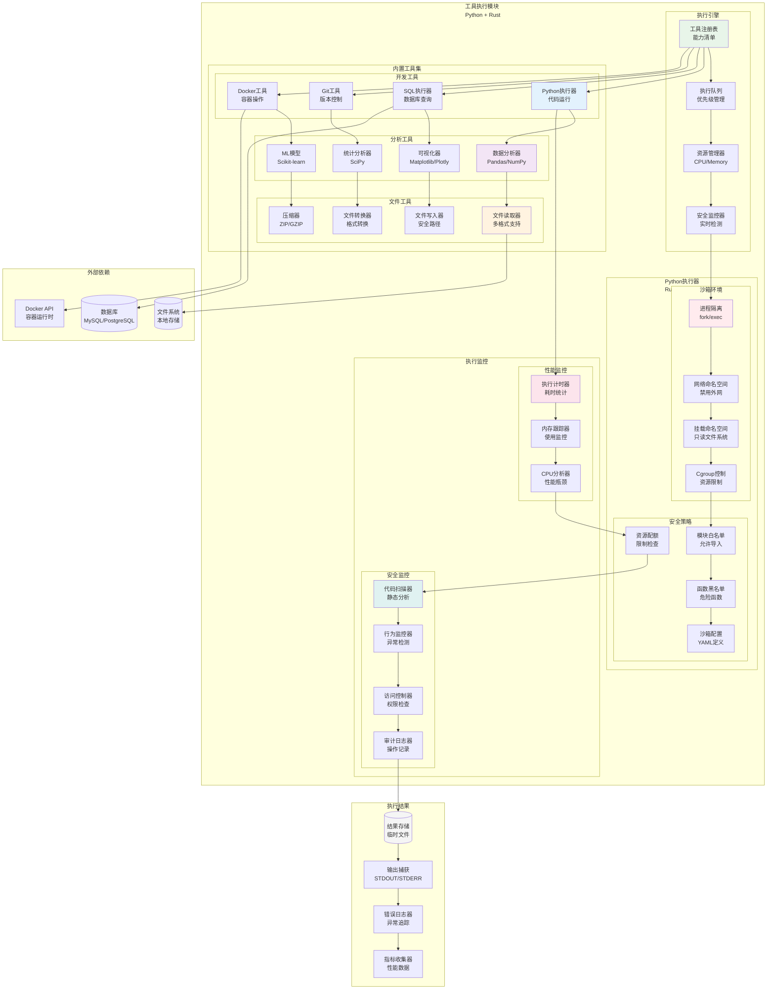
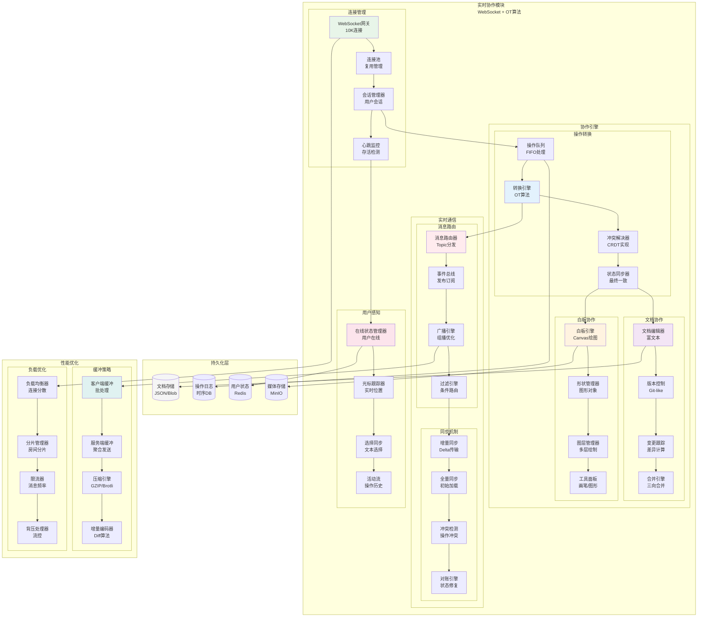

# AgenticGen 功能模块架构图

本文档包含AgenticGen各核心功能模块的详细架构图。

## 目录
- [智能体管理模块](#智能体管理模块)
- [知识库模块](#知识库模块)
- [工具执行模块](#工具执行模块)
- [实时协作模块](#实时协作模块)
- [指标收集模块](#指标收集模块)
- [缓存引擎模块](#缓存引擎模块)
- [向量引擎模块](#向量引擎模块)
- [编排引擎模块](#编排引擎模块)
- [Python沙箱模块](#python沙箱模块)
- [认证授权模块](#认证授权模块)

## 智能体管理模块



## 知识库模块



## 工具执行模块



## 实时协作模块



## 指标收集模块

```mermaid
graph TB
    subgraph "指标收集模块<br/>Rust实现"
        subgraph "核心引擎"
            MetricsCore[指标核心<br/>无锁设计]
            Aggregator[聚合器<br/>实时计算]
            Sampler[采样器<br/>策略控制]
            Registry[注册表<br/>指标目录]
        end

        subgraph "指标类型"
            subgraph "计数器"
                Counter[计数器<br/>AtomicU64]
                RateCounter[速率计数器<br/>QPS计算]
                DeltaCounter[增量计数器<br/>差值计算]
                BucketCounter[桶计数器<br/>分布统计]
            end

            subgraph "仪表盘"
                Gauge[仪表盘<br/>瞬时值]
                DerivedGauge[推导仪表盘<br/>计算值]
                MonotonicGauge[单调仪表盘<br/>只增不减]
                SetGauge[集合仪表盘<br/>基数估算]
            end

            subgraph "直方图"
                Histogram[直方图<br/>分布统计]
                Timer[计时器<br/>延迟测量]
                Summary[摘要<br/>分位数]
                ExponentialHistogram[指数直方图<br/>动态桶]
            end
        end

        subgraph "性能优化"
            subgraph "并发设计"
                DashMap[DashMap<br/>并发HashMap]
                RwLock[读写锁<br/>共享访问]
                AtomicOps[原子操作<br/>Lock-Free]
                MemoryPool[内存池<br/>预分配]
            end

            subgraph "批处理"
                Batcher[批处理器<br/>批量聚合]
                FlushManager[刷新管理器<br/>定时/大小]
                Compression[压缩器<br/>Snappy/Zstd]
                BufferPool[缓冲池<br/>复用机制]
            end
        end

        subgraph "导出器"
            subgraph "协议支持"
                PrometheusExporter[Prometheus导出器<br/>Pull模式]
                OpenTelemetry[OpenTelemetry<br/>云原生]
                StatsD[StatsD<br/>UDP/TCP]
                CustomFormat[自定义格式<br/>JSON/Protobuf]
            end

            subgraph "存储后端"
                MemoryStore[内存存储<br/>临时缓存]
                DiskStore[磁盘存储<br/>持久化]
                RemoteStore[远程存储<br/>HTTP/gRPC]
            end
        end
    end

    subgraph "性能监控"
        subgraph "自监控"
            SelfMetrics[自监控指标<br/>内部状态]
            HealthChecker[健康检查器<br/>存活检测]
            PerformanceProfiler[性能分析器<br/>CPU/Memory]
            MemoryTracker[内存跟踪器<br/>泄漏检测]
        end

        subgraph "告警系统"
            AlertManager[告警管理器<br/>规则引擎]
            ThresholdMonitor[阈值监控器<br/>SLI/SLO]
            AnomalyDetector[异常检测器<br/>ML算法]
            NotificationService[通知服务<br/>邮件/Slack]
        end
    end

    subgraph "Python绑定"
        subgraph "FFI接口"
            CTypesWrapper[CTypes包装器<br/>动态链接]
            PyO3Binding[PyO3绑定<br/>原生集成]
            AsyncInterface[异步接口<br/>await支持]
            TypeMapping[类型映射<br/>Python<->Rust]
        end

        subgraph "高级功能"
            Decorators[装饰器<br/>@metrics.track]
            ContextManager[上下文管理器<br/>with语句]
            AutoDiscovery[自动发现<br/>动态注册]
            Integration[集成库<br/>FastAPI/Django]
        end
    end

    %% 连接关系
    MetricsCore --> Aggregator
    Aggregator --> Sampler
    Sampler --> Registry

    Registry --> Counter
    Registry --> Gauge
    Registry --> Histogram

    Counter --> DashMap
    Gauge --> RwLock
    Histogram --> AtomicOps
    AtomicOps --> MemoryPool

    Aggregator --> Batcher
    Batcher --> FlushManager
    FlushManager --> Compression
    Compression --> BufferPool

    Registry --> PrometheusExporter
    PrometheusExporter --> OpenTelemetry
    OpenTelemetry --> StatsD
    StatsD --> CustomFormat

    CustomFormat --> MemoryStore
    MemoryStore --> DiskStore
    DiskStore --> RemoteStore

    MetricsCore --> SelfMetrics
    SelfMetrics --> HealthChecker
    HealthChecker --> PerformanceProfiler
    PerformanceProfiler --> MemoryTracker

    PerformanceProfiler --> AlertManager
    AlertManager --> ThresholdMonitor
    ThresholdMonitor --> AnomalyDetector
    AnomalyDetector --> NotificationService

    RemoteStore --> CTypesWrapper
    CTypesWrapper --> PyO3Binding
    PyO3Binding --> AsyncInterface
    AsyncInterface --> TypeMapping

    TypeMapping --> Decorators
    Decorators --> ContextManager
    ContextManager --> AutoDiscovery
    AutoDiscovery --> Integration

    style MetricsCore fill:#ffebee
    style Counter fill:#e8f5e9
    style DashMap fill:#fff3e0
    style Batcher fill:#e3f2fd
    style PrometheusExporter fill:#f3e5f5
    style SelfMetrics fill:#fce4ec
    style CTypesWrapper fill:#e0f2f1
    style Decorators fill:#f5f5f5
```

## 缓存引擎模块

```mermaid
graph TB
    subgraph "缓存引擎模块<br/>Rust实现"
        subgraph "多级缓存架构"
            L1Cache[L1缓存<br/>内存缓存<br/>418K ops/sec]
            L2Cache[L2缓存<br/>Redis分布式<br/>50K ops/sec]
            L3Cache[L3缓存<br/>磁盘持久化<br/>10K ops/sec]
            CacheCoordinator[缓存协调器<br/>层级管理]
        end

        subgraph "缓存策略"
            subgraph "淘汰策略"
                LRU[LRU算法<br/>最近最少使用]
                LFU[LFU算法<br/>最少使用频率]
                TTL[TTL过期<br/>生存时间]
                SizeLimit[大小限制<br/>容量控制]
            end

            subgraph "一致性策略"
                WriteThrough[写穿透<br/>同步写入]
                WriteBack[写回<br/>延迟写入]
                WriteAround[写绕过<br/>直接写后端]
                RefreshAhead[预刷新<br/>主动更新]
            end
        end

        subgraph "核心实现"
            subgraph "数据结构"
                CacheEntry[缓存条目<br/>Key-Value]
                Metadata[元数据<br/>TTL/计数器]
                IndexTable[索引表<br/>快速查找]
                EvictionQueue[淘汰队列<br/>双向链表]
            end

            subgraph "并发控制"
                DashMapCache[DashMap缓存<br/>并发安全]
                RwLockCache[读写锁缓存<br/>细粒度锁]
                AtomicCounter[原子计数器<br/>无锁统计]
                ThreadPool[线程池<br/>任务调度]
            end
        end

        subgraph "高级功能"
            subgraph "智能缓存"
                PredictivePrefetch[预测预取<br/>机器学习]
                HotDataDetect[热点数据检测<br/>访问模式]
                AdaptiveTTL[自适应TTL<br/>动态调整]
                Compression[压缩存储<br/>节省空间]
            end

            subgraph "监控分析"
                CacheMetrics[缓存指标<br/>命中率/延迟]
                PatternAnalyzer[模式分析器<br/>访问模式]
                SizeAnalyzer[大小分析器<br/>存储优化]
                PerformanceProfiler[性能分析器<br/>瓶颈定位]
            end
        end
    end

    subgraph "存储后端"
        subgraph "内存存储"
            BTreeMap[BTreeMap<br/>有序存储]
            HashMap[HashMap<br/>哈希存储]
            ConcurrentMap[并发Map<br/>DashMap]
            MemoryPool[内存池<br/>预分配]
        end

        subgraph "外部存储"
            RedisCluster[Redis集群<br/>分片存储]
            RocksDB[RocksDB<br/>嵌入式KV]
            FileStorage[文件存储<br/>持久化]
            CloudStorage[云存储<br/>S3/OSS]
        end
    end

    subgraph "Python接口"
        subgraph "绑定层"
            PythonAPI[Python API<br/>pyo3/ctypes]
            AsyncAPI[异步API<br/>async/await]
            TypedAPI[类型化API<br/>泛型支持]
            ContextAPI[上下文API<br/>请求追踪]
        end

        subgraph "集成库"
            DjangoCache[Django缓存<br/>后端集成]
            FastAPICache[FastAPI缓存<br/>依赖注入]
            CeleryCache[Celery缓存<br/>任务队列]
            SQLAlchemyCache[SQLAlchemy缓存<br/>查询缓存]
        end
    end

    %% 连接关系
    L1Cache --> L2Cache
    L2Cache --> L3Cache
    L3Cache --> CacheCoordinator

    CacheCoordinator --> LRU
    LRU --> LFU
    LFU --> TTL
    TTL --> SizeLimit

    SizeLimit --> WriteThrough
    WriteThrough --> WriteBack
    WriteBack --> WriteAround
    WriteAround --> RefreshAhead

    RefreshAhead --> CacheEntry
    CacheEntry --> Metadata
    Metadata --> IndexTable
    IndexTable --> EvictionQueue

    EvictionQueue --> DashMapCache
    DashMapCache --> RwLockCache
    RwLockCache --> AtomicCounter
    AtomicCounter --> ThreadPool

    ThreadPool --> PredictivePrefetch
    PredictivePrefetch --> HotDataDetect
    HotDataDetect --> AdaptiveTTL
    AdaptiveTTL --> Compression

    Compression --> CacheMetrics
    CacheMetrics --> PatternAnalyzer
    PatternAnalyzer --> SizeAnalyzer
    SizeAnalyzer --> PerformanceProfiler

    L1Cache --> BTreeMap
    BTreeMap --> HashMap
    HashMap --> ConcurrentMap
    ConcurrentMap --> MemoryPool

    L2Cache --> RedisCluster
    L3Cache --> RocksDB
    RocksDB --> FileStorage
    FileStorage --> CloudStorage

    CacheCoordinator --> PythonAPI
    PythonAPI --> AsyncAPI
    AsyncAPI --> TypedAPI
    TypedAPI --> ContextAPI

    ContextAPI --> DjangoCache
    DjangoCache --> FastAPICache
    FastAPICache --> CeleryCache
    CeleryCache --> SQLAlchemyCache

    style L1Cache fill:#ffebee
    style LRU fill:#e8f5e9
    style CacheEntry fill:#fff3e0
    style DashMapCache fill:#e3f2fd
    style PredictivePrefetch fill:#f3e5f5
    style CacheMetrics fill:#fce4ec
    style BTreeMap fill:#e0f2f1
    style RedisCluster fill:#f5f5f5
    style PythonAPI fill:#e1f5fe
```



## 向量引擎模块

```mermaid
graph TB
    subgraph "向量引擎模块<br/>Rust实现"
        subgraph "核心计算引擎"
            SIMDProcessor[SIMD处理器<br/>AVX/SSE指令]
            VectorMath[向量数学库<br/>ndarray]
            DistanceCalculator[距离计算器<br/>多度量支持]
            BatchProcessor[批处理器<br/>并行计算]
        end

        subgraph "索引结构"
            subgraph "近似搜索"
                HNSWIndex[HNSW索引<br/>层次小世界图]
                IVFIndex[IVF索引<br/>倒排文件]
                LSHIndex[LSH索引<br/>局部敏感哈希]
                PQIndex[PQ索引<br/>乘积量化]
            end

            subgraph "精确搜索"
                BruteForce[暴力搜索<br/>全量比较]
                BKTree[BK树<br/>编辑距离]
                VPTree[VP树<br/>Vantage Point]
                CoverTree[覆盖树<br/>度量空间]
            end
        end

        subgraph "向量操作"
            subgraph "基础操作"
                VectorAdd[向量加法<br/>逐元素相加]
                VectorMul[向量乘法<br/>标量/向量]
                Normalize[归一化<br/>L2/L1/Max]
                PCA[PCA降维<br/>主成分分析]
            end

            subgraph "高级操作"
                Clustering[聚类算法<br/>K-means/DBSCAN]
                DimensionReduction[降维算法<br/>t-SNE/UMAP]
                AnomalyDetection[异常检测<br/>LOF/IForest]
                Approximation[近似算法<br/>采样/量化]
            end
        end

        subgraph "性能优化"
            subgraph "并行计算"
                RayonParallel[Rayon并行<br/>数据并行]
                ThreadPool[线程池<br/>任务调度]
                WorkStealing[工作窃取<br/>负载均衡]
                NumaAware[NUMA感知<br/>亲和性]
            end

            subgraph "内存优化"
                MemoryMapping[内存映射<br/>大文件支持]
                LazyLoading[懒加载<br/>按需加载]
                Compression[向量压缩<br/>标量/乘积]
            CacheOptimization[缓存优化<br/>预取/对齐]
            end
        end
    end

    subgraph "数据管理"
        subgraph "向量存储"
            InMemoryStore[内存存储<br/>RAM快速访问]
            DiskStore[磁盘存储<br/>持久化]
            HybridStore[混合存储<br/>热/冷数据]
            DistributedStore[分布式存储<br/>分片/复制]
        end

        subgraph "元数据管理"
            VectorMetadata[向量元数据<br/>ID/标签]
            IndexMetadata[索引元数据<br/>参数/统计]
            VersionControl[版本控制<br/>A/B测试]
            Schema[Schema定义<br/>向量维度]
        end
    end

    subgraph "Python集成"
        subgraph "绑定接口"
            NumPyBinding[NumPy绑定<br/>零拷贝]
            PyTorchBinding[PyTorch绑定<br/>GPU支持]
            FastAPIBinding[FastAPI绑定<br/>HTTP API]
            AsyncBinding[异步绑定<br/>协程支持]
        end

        subgraph "算法集成"
            ScikitLearn[Scikit-learn<br/>传统ML]
            SentenceTransformers[Sentence-BERT<br/>嵌入模型]
            OpenAIEmbeddings[OpenAI Embeddings<br/>API集成]
            HuggingFace[Hugging Face<br/>Transformers]
        end
    end

    %% 连接关系
    SIMDProcessor --> VectorMath
    VectorMath --> DistanceCalculator
    DistanceCalculator --> BatchProcessor

    BatchProcessor --> HNSWIndex
    HNSWIndex --> IVFIndex
    IVFIndex --> LSHIndex
    LSHIndex --> PQIndex

    PQIndex --> BruteForce
    BruteForce --> BKTree
    BKTree --> VPTree
    VPTree --> CoverTree

    CoverTree --> VectorAdd
    VectorAdd --> VectorMul
    VectorMul --> Normalize
    Normalize --> PCA

    PCA --> Clustering
    Clustering --> DimensionReduction
    DimensionReduction --> AnomalyDetection
    AnomalyDetection --> Approximation

    Approximation --> RayonParallel
    RayonParallel --> ThreadPool
    ThreadPool --> WorkStealing
    WorkStealing --> NumaAware

    NumaAware --> MemoryMapping
    MemoryMapping --> LazyLoading
    LazyLoading --> Compression
    Compression --> CacheOptimization

    CacheOptimization --> InMemoryStore
    InMemoryStore --> DiskStore
    DiskStore --> HybridStore
    HybridStore --> DistributedStore

    DistributedStore --> VectorMetadata
    VectorMetadata --> IndexMetadata
    IndexMetadata --> VersionControl
    VersionControl --> Schema

    Schema --> NumPyBinding
    NumPyBinding --> PyTorchBinding
    PyTorchBinding --> FastAPIBinding
    FastAPIBinding --> AsyncBinding

    AsyncBinding --> ScikitLearn
    ScikitLearn --> SentenceTransformers
    SentenceTransformers --> OpenAIEmbeddings
    OpenAIEmbeddings --> HuggingFace

    style SIMDProcessor fill:#ffebee
    style HNSWIndex fill:#e8f5e9
    style VectorAdd fill:#fff3e0
    style Clustering fill:#e3f2fd
    style RayonParallel fill:#f3e5f5
    style MemoryMapping fill:#fce4ec
    style InMemoryStore fill:#e0f2f1
    style VectorMetadata fill:#f5f5f5
    style NumPyBinding fill:#e1f5fe
    style ScikitLearn fill:#e8f5e9
```



## 编排引擎模块

```mermaid
graph TB
    subgraph "编排引擎模块<br/>Go实现"
        subgraph "核心组件"
            TaskQueue[任务队列<br/>优先级队列]
            WorkerPool[工作池<br/>协程池]
            Scheduler[调度器<br/>任务分发]
            Dispatcher[分发器<br/>负载均衡]
        end

        subgraph "任务管理"
            subgraph "任务生命周期"
                TaskCreator[任务创建器<br/>任务定义]
                TaskValidator[任务验证器<br/>输入检查]
                TaskExecutor[任务执行器<br/>运行管理]
                TaskMonitor[任务监控器<br/>状态跟踪]
            end

            subgraph "依赖管理"
                DAGBuilder[DAG构建器<br/>依赖图]
                DependencyResolver[依赖解析器<br/>拓扑排序]
                CriticalPath[关键路径<br/>最长路径]
                ParallelScheduler[并行调度器<br/>独立任务]
            end
        end

        subgraph "资源管理"
            subgraph "资源分配"
                ResourceCalculator[资源计算器<br/>需求评估]
                ResourceAllocator[资源分配器<br/>CPU/Memory]
                ResourcePool[资源池<br/>预留/释放]
                ResourceManager[资源管理器<br/>全局视图]
            end

            subgraph "调度策略"
                FIFOScheduler[FIFO调度<br/>先进先出]
                PriorityScheduler[优先级调度<br/>权重分配]
                FairScheduler[公平调度<br/>资源公平]
                DeadlineScheduler[截止时间调度<br/>SLA保证]
            end
        end

        subgraph "工作流引擎"
            subgraph "流程控制"
                SequenceFlow[顺序流<br/>串行执行]
                ParallelFlow[并行流<br/>并发执行]
                ConditionalFlow[条件流<br/>分支选择]
                LoopFlow[循环流<br/>迭代执行]
            end

            subgraph "错误处理"
                RetryPolicy[重试策略<br/>指数退避]
                CircuitBreaker[熔断器<br/>故障隔离]
                FallbackHandler[降级处理器<br/>备选方案]
                Compensation[补偿机制<br/>事务回滚]
            end
        end
    end

    subgraph "通信层"
        subgraph "消息传递"
            EventBus[事件总线<br/>发布订阅]
            MessageBroker[消息代理<br/>Redis Streams]
            RPCServer[RPC服务器<br/>gRPC]
            WebSocketServer[WebSocket服务器<br/>实时通信]
        end

        subgraph "服务发现"
            ServiceRegistry[服务注册表<br/>Consul]
            HealthChecker[健康检查器<br/>存活检测]
            LoadBalancer[负载均衡器<br/>请求分发]
            FailoverManager[故障转移<br/>高可用]
        end
    end

    subgraph "监控与调试"
        subgraph "可观测性"
            Tracing[链路追踪<br/>Jaeger]
            Metrics[指标收集<br/>Prometheus]
            Logging[日志记录<br/>结构化]
            Profiling[性能分析<br/>pprof]
        end

        subgraph "调试工具"
            TaskVisualizer[任务可视化<br/>DAG图]
            StepDebugger[步骤调试器<br/>断点执行]
            ReplayEngine[回放引擎<br/>故障重现]
            Benchmark[基准测试<br/>性能对比]
        end
    end

    %% 连接关系
    TaskQueue --> WorkerPool
    WorkerPool --> Scheduler
    Scheduler --> Dispatcher

    Dispatcher --> TaskCreator
    TaskCreator --> TaskValidator
    TaskValidator --> TaskExecutor
    TaskExecutor --> TaskMonitor

    TaskMonitor --> DAGBuilder
    DAGBuilder --> DependencyResolver
    DependencyResolver --> CriticalPath
    CriticalPath --> ParallelScheduler

    ParallelScheduler --> ResourceCalculator
    ResourceCalculator --> ResourceAllocator
    ResourceAllocator --> ResourcePool
    ResourcePool --> ResourceManager

    ResourceManager --> FIFOScheduler
    FIFOScheduler --> PriorityScheduler
    PriorityScheduler --> FairScheduler
    FairScheduler --> DeadlineScheduler

    DeadlineScheduler --> SequenceFlow
    SequenceFlow --> ParallelFlow
    ParallelFlow --> ConditionalFlow
    ConditionalFlow --> LoopFlow

    LoopFlow --> RetryPolicy
    RetryPolicy --> CircuitBreaker
    CircuitBreaker --> FallbackHandler
    FallbackHandler --> Compensation

    Compensation --> EventBus
    EventBus --> MessageBroker
    MessageBroker --> RPCServer
    RPCServer --> WebSocketServer

    WebSocketServer --> ServiceRegistry
    ServiceRegistry --> HealthChecker
    HealthChecker --> LoadBalancer
    LoadBalancer --> FailoverManager

    FailoverManager --> Tracing
    Tracing --> Metrics
    Metrics --> Logging
    Logging --> Profiling

    Profiling --> TaskVisualizer
    TaskVisualizer --> StepDebugger
    StepDebugger --> ReplayEngine
    ReplayEngine --> Benchmark

    style TaskQueue fill:#e8f5e9
    style TaskCreator fill:#fff3e0
    style DAGBuilder fill:#e3f2fd
    style ResourceCalculator fill:#f3e5f5
    style FIFOScheduler fill:#ffebee
    style SequenceFlow fill:#fce4ec
    style RetryPolicy fill:#e0f2f1
    style EventBus fill:#f5f5f5
    style ServiceRegistry fill:#e1f5fe
    style Tracing fill:#e8f5e9
    style TaskVisualizer fill:#f5f5f5
```



## Python沙箱模块

```mermaid
graph TB
    subgraph "Python沙箱模块<br/>Rust实现"
        subgraph "核心沙箱"
            SandboxCore[沙箱核心<br/>进程隔离]
            ProcessSpawner[进程生成器<br/>fork/exec]
            ResourceMonitor[资源监控器<br/>CPU/Memory]
            ExecutionTimer[执行计时器<br/>超时控制]
        end

        subgraph "安全隔离"
            subgraph "命名空间隔离"
                PidNamespace[PID命名空间<br/>进程隔离]
                NetworkNamespace[网络命名空间<br/>禁用网络]
                MountNamespace[挂载命名空间<br/>文件系统隔离]
                UTSNamespace[UTS命名空间<br/>主机名隔离]
            end

            subgraph "权限控制"
                CapabilityDrop[权限丢弃<br/>最小权限]
                SeccompFilter[Seccomp过滤<br/>系统调用限制]
                NoNewPrivs[无新权限<br/>禁止提权]
                UserNamespace[用户命名空间<br/>非root运行]
            end
        end

        subgraph "代码安全"
            subgraph "静态分析"
                ASTParser[AST解析器<br/>语法树分析]
                DangerousCallDetector[危险调用检测<br/>黑名单函数]
                ImportRestrictor[导入限制器<br/>模块白名单]
                CodeValidator[代码验证器<br/>安全规则]
            end

            subgraph "运行时保护"
                BuiltinOverride[内置函数重写<br/>移除危险函数]
                ModuleHooker[模块钩子器<br/>拦截导入]
                SyscallInterceptor[系统调用拦截<br/>动态过滤]
                MemoryGuard[内存保护器<br/>缓冲区保护]
            end
        end

        subgraph "资源限制"
            subgraph "CPU限制"
                CPULimiter[CPU限制器<br/>cgroup quota]
                CPUMask[CPU掩码<br/>核心绑定]
                NiceLevel[Nice级别<br/>优先级调整]
                RTScheduler[实时调度器<br/>RT限制]
            end

            subgraph "内存限制"
                MemoryLimiter[内存限制器<br/>cgroup memory]
                HeapSizeLimit[堆大小限制<br/>malloc钩子]
                FileDescriptorLimit[文件描述符限制<br/>ulimit]
                DiskQuota[磁盘配额<br/>空间限制]
            end
        end

        subgraph "执行环境"
            subgraph "环境配置"
                EnvironmentBuilder[环境构建器<br/>PATH/ENV]
                WorkingDirectory[工作目录<br/>隔离空间]
                TempDirectory[临时目录<br/>自动清理]
                StdioRedirect[标准IO重定向<br/>管道/文件]
            end

            subgraph "包管理"
                VirtualEnv[虚拟环境<br/>独立Python]
                PackageInstaller[包安装器<br/>pip/conda]
                VersionManager[版本管理器<br/>多版本共存]
                DependencyChecker[依赖检查器<br/>冲突检测]
            end
        end
    end

    subgraph "输出处理"
        subgraph "流处理"
            OutputCapture[输出捕获<br/>STDOUT/STDERR]
            StreamBuffer[流缓冲器<br/>行缓冲]
            FilterChain[过滤链<br/>敏感信息]
            Formatter[格式化器<br/>ANSI/HTML]
        end

        subgraph "结果管理"
            ResultSerializer[结果序列化<br/>JSON/Pickle]
            ArtifactCollector[产物收集器<br/>文件/图表]
            ErrorCollector[错误收集器<br/>异常追踪]
            MetadataExtractor[元数据提取器<br/>执行信息]
        end
    end

    subgraph "Python接口"
        subgraph "绑定层"
            PyO3Binding[PyO3绑定<br/>原生集成]
            CTypesWrapper[CTypes包装<br/>动态库]
            AsyncExecutor[异步执行器<br/>async/await]
            ContextManager[上下文管理<br/>with语句]
        end

        subgraph "API接口"
            SecureExecutor[安全执行器<br/>execute_code]
            SessionManager[会话管理器<br/>持久会话]
            TemplateEngine[模板引擎<br/>代码模板]
            NotebookInterface[Notebook接口<br/>Jupyter兼容]
        end
    end

    %% 连接关系
    SandboxCore --> ProcessSpawner
    ProcessSpawner --> ResourceMonitor
    ResourceMonitor --> ExecutionTimer

    ExecutionTimer --> PidNamespace
    PidNamespace --> NetworkNamespace
    NetworkNamespace --> MountNamespace
    MountNamespace --> UTSNamespace

    UTSNamespace --> CapabilityDrop
    CapabilityDrop --> SeccompFilter
    SeccompFilter --> NoNewPrivs
    NoNewPrivs --> UserNamespace

    UserNamespace --> ASTParser
    ASTParser --> DangerousCallDetector
    DangerousCallDetector --> ImportRestrictor
    ImportRestrictor --> CodeValidator

    CodeValidator --> BuiltinOverride
    BuiltinOverride --> ModuleHooker
    ModuleHooker --> SyscallInterceptor
    SyscallInterceptor --> MemoryGuard

    MemoryGuard --> CPULimiter
    CPULimiter --> CPUMask
    CPUMask --> NiceLevel
    NiceLevel --> RTScheduler

    RTScheduler --> MemoryLimiter
    MemoryLimiter --> HeapSizeLimit
    HeapSizeLimit --> FileDescriptorLimit
    FileDescriptorLimit --> DiskQuota

    DiskQuota --> EnvironmentBuilder
    EnvironmentBuilder --> WorkingDirectory
    WorkingDirectory --> TempDirectory
    TempDirectory --> StdioRedirect

    StdioRedirect --> VirtualEnv
    VirtualEnv --> PackageInstaller
    PackageInstaller --> VersionManager
    VersionManager --> DependencyChecker

    DependencyChecker --> OutputCapture
    OutputCapture --> StreamBuffer
    StreamBuffer --> FilterChain
    FilterChain --> Formatter

    Formatter --> ResultSerializer
    ResultSerializer --> ArtifactCollector
    ArtifactCollector --> ErrorCollector
    ErrorCollector --> MetadataExtractor

    MetadataExtractor --> PyO3Binding
    PyO3Binding --> CTypesWrapper
    CTypesWrapper --> AsyncExecutor
    AsyncExecutor --> ContextManager

    ContextManager --> SecureExecutor
    SecureExecutor --> SessionManager
    SessionManager --> TemplateEngine
    TemplateEngine --> NotebookInterface

    style SandboxCore fill:#ffebee
    style PidNamespace fill:#e8f5e9
    style CapabilityDrop fill:#fff3e0
    style ASTParser fill:#e3f2fd
    style BuiltinOverride fill:#f3e5f5
    style CPULimiter fill:#fce4ec
    style EnvironmentBuilder fill:#e0f2f1
    style OutputCapture fill:#f5f5f5
    style PyO3Binding fill:#e1f5fe
    style SecureExecutor fill:#e8f5e9
```



## 认证授权模块

```mermaid
graph TB
    subgraph "认证授权模块<br/>Python实现"
        subgraph "认证系统"
            subgraph "认证方式"
                JWTAuth[JWT认证<br/>双令牌机制]
                OAuth2[OAuth2/OIDC<br/>第三方登录]
                APIKeyAuth[API密钥认证<br/>HMAC签名]
                CertificateAuth[证书认证<br/>mTLS]
            end

            subgraph "令牌管理"
                TokenGenerator[令牌生成器<br/>加密签名]
                TokenValidator[令牌验证器<br/>黑名单/过期]
                RefreshToken[刷新令牌<br/>自动续期]
                TokenRevocation[令牌撤销<br/>主动失效]
            end

            subgraph "会话管理"
                SessionStore[会话存储<br/>Redis分布式]
                SessionTracker[会话跟踪器<br/>活跃会话]
                ConcurrentSession[并发控制<br/>多设备限制]
                SessionTimeout[会话超时<br/>自动登出]
            end
        end

        subgraph "授权系统"
            subgraph "RBAC模型"
                RoleManager[角色管理器<br/>7个预定义角色]
                PermissionManager[权限管理器<br/>资源权限]
                RoleBinding[角色绑定<br/>用户-角色]
                PermissionChecker[权限检查器<br/>实时验证]
            end

            subgraph "ABAC模型"
                AttributeCollector[属性收集器<br/>上下文属性]
                PolicyEngine[策略引擎<br/>规则评估]
                PolicyDecision[策略决策<br/>允许/拒绝]
                DynamicPermission[动态权限<br/>条件授权]
            end

            subgraph "资源ACL"
                ResourceOwner[资源所有者<br/>Owner权限]
                ACLManager[ACL管理器<br/>访问控制列表]
                InheritanceEngine[继承引擎<br/>权限继承]
                DelegationSystem[委托系统<br/>权限转授]
            end
        end

        subgraph "安全增强"
            subgraph "多因子认证"
                TOTPAuth[时间OTP<br/>Google Authenticator]
                SMSAuth[短信验证<br/>SMS Gateway]
                EmailAuth[邮件验证<br/>SMTP服务]
                BiometricAuth[生物认证<br/>指纹/面部]
            end

            subgraph "风险评估"
                RiskEngine[风险评估引擎<br/>机器学习]
                BehaviorAnalyzer[行为分析器<br/>异常检测]
                GeoLocation[地理位置<br/>IP验证]
                DeviceFingerprint[设备指纹<br/>浏览器指纹]
            end

            subgraph "防护机制"
                RateLimiter[限流器<br/>请求频率]
                BruteForceProtection[暴力破解防护<br/>尝试限制]
                AccountLockout[账户锁定<br/>临时/永久]
                SuspiciousActivity[可疑活动<br/>自动告警]
            end
        end
    end

    subgraph "用户管理"
        subgraph "用户生命周期"
            UserRegistration[用户注册<br/>邮箱验证]
            UserProfile[用户档案<br/>个人信息]
            PasswordManager[密码管理器<br/>强度/重置]
            UserStatus[用户状态<br/>激活/禁用]
        end

        subgraph "组织管理"
                OrgHierarchy[组织层级<br/>部门/团队]
                MemberManagement[成员管理<br/>邀请/移除]
                OrgRole[组织角色<br/>管理员/成员]
                ResourceQuota[资源配额<br/>限制控制]
            end

            subgraph "审计日志"
                AuditLogger[审计日志器<br/>操作记录]
                ComplianceChecker[合规检查器<br/>SOX/GDPR]
                ReportGenerator[报告生成器<br/>审计报告]
                LogRetention[日志保留<br/>归档策略]
            end
        end

        subgraph "集成接口"
            subgraph "身份提供商"
                LDAPIntegration[LDAP集成<br/>企业AD]
                SAMLIntegration[SAML集成<br/>SSO]
                ActiveDirectory[Active Directory<br/>Windows认证]
                CustomIdP[自定义IdP<br/>OAuth2/OIDC]
            end

            subgraph "API集成"
                AuthMiddleware[认证中间件<br/>FastAPI/Django]
                GraphQLAuth[GraphQL认证<br/>指令保护]
                GatewayAuth[网关认证<br/>Kong/Istio]
                ServiceMesh[服务网格<br/>mTLS]
            end
        end
    end

    subgraph "存储层"
        UserDB[(用户数据库<br/>MySQL)]
        RoleDB[(角色数据库<br/>MySQL)]
        PermissionDB[(权限数据库<br/>MySQL)]
        AuditDB[(审计数据库<br/>ElasticSearch)]
        SessionCache[(会话缓存<br/>Redis)]
        BlacklistCache[(黑名单缓存<br/>Redis)]
    end

    %% 连接关系
    JWTAuth --> TokenGenerator
    TokenGenerator --> TokenValidator
    TokenValidator --> RefreshToken
    RefreshToken --> TokenRevocation

    TokenRevocation --> SessionStore
    SessionStore --> SessionTracker
    SessionTracker --> ConcurrentSession
    ConcurrentSession --> SessionTimeout

    SessionTimeout --> RoleManager
    RoleManager --> PermissionManager
    PermissionManager --> RoleBinding
    RoleBinding --> PermissionChecker

    PermissionChecker --> AttributeCollector
    AttributeCollector --> PolicyEngine
    PolicyEngine --> PolicyDecision
    PolicyDecision --> DynamicPermission

    DynamicPermission --> ResourceOwner
    ResourceOwner --> ACLManager
    ACLManager --> InheritanceEngine
    InheritanceEngine --> DelegationSystem

    DelegationSystem --> TOTPAuth
    TOTPAuth --> SMSAuth
    SMSAuth --> EmailAuth
    EmailAuth --> BiometricAuth

    BiometricAuth --> RiskEngine
    RiskEngine --> BehaviorAnalyzer
    BehaviorAnalyzer --> GeoLocation
    GeoLocation --> DeviceFingerprint

    DeviceFingerprint --> RateLimiter
    RateLimiter --> BruteForceProtection
    BruteForceProtection --> AccountLockout
    AccountLockout --> SuspiciousActivity

    SuspiciousActivity --> UserRegistration
    UserRegistration --> UserProfile
    UserProfile --> PasswordManager
    PasswordManager --> UserStatus

    UserStatus --> OrgHierarchy
    OrgHierarchy --> MemberManagement
    MemberManagement --> OrgRole
    OrgRole --> ResourceQuota

    ResourceQuota --> AuditLogger
    AuditLogger --> ComplianceChecker
    ComplianceChecker --> ReportGenerator
    ReportGenerator --> LogRetention

    LogRetention --> LDAPIntegration
    LDAPIntegration --> SAMLIntegration
    SAMLIntegration --> ActiveDirectory
    ActiveDirectory --> CustomIdP

    CustomIdP --> AuthMiddleware
    AuthMiddleware --> GraphQLAuth
    GraphQLAuth --> GatewayAuth
    GatewayAuth --> ServiceMesh

    ServiceMesh --> UserDB
    UserDB --> RoleDB
    RoleDB --> PermissionDB
    PermissionDB --> AuditDB
    AuditDB --> SessionCache
    SessionCache --> BlacklistCache

    style JWTAuth fill:#e8f5e9
    style TokenGenerator fill:#fff3e0
    style SessionStore fill:#e3f2fd
    style RoleManager fill:#f3e5f5
    style AttributeCollector fill:#ffebee
    style ResourceOwner fill:#fce4ec
    style TOTPAuth fill:#e0f2f1
    style RiskEngine fill:#f5f5f5
    style RateLimiter fill:#e1f5fe
    style UserRegistration fill:#e8f5e9
    style OrgHierarchy fill:#f5f5f5
    style AuditLogger fill:#e3f2fd
    style LDAPIntegration fill:#fff3e0
    style AuthMiddleware fill:#f3e5f5
    style UserDB fill:#f5f5f5
```

---

## 总结

AgenticGen的模块化架构设计确保了：

1. **高内聚低耦合**：每个模块职责明确，接口清晰
2. **可扩展性**：支持插件化扩展和自定义功能
3. **高性能**：关键模块使用Rust实现极致性能
4. **高可用**：模块间解耦，支持独立部署和扩展
5. **安全性**：完整的认证授权和安全防护机制

这种模块化设计为构建企业级AI平台提供了坚实的基础。