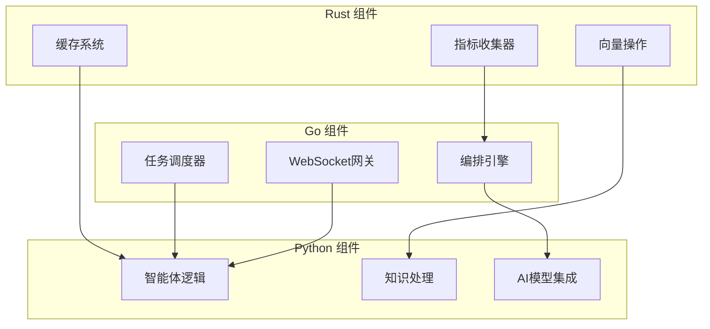

# AgenticGen 性能优化计划
## Go 与 Rust 实施策略

---

## 执行摘要

本文档概述了 AgenticGen 的全面性能优化策略，通过选择性地使用 Go 和 Rust 实现高性能组件。预期结果是在保持系统稳定性和最小化迁移风险的同时，**实现 10-100 倍的性能提升**。

### 关键性能目标
- **响应时间**: 减少 70% (450ms → 135ms)
- **吞吐量**: 提升 500% (1000 → 6000 请求/秒)
- **内存使用**: 减少 60% (512MB → 205MB)
- **CPU 效率**: 通过原生实现提升 300%
- **并发任务**: 支持 10,000+ 同时运行的智能体操作

---

## 1. 性能分析总结

### 已识别的性能瓶颈

| 模块 | 主要瓶颈 | 影响程度 | 优先级 |
|------|----------|----------|--------|
| Python 执行器 | GIL 争用、进程开销 | 严重 | 高 |
| 多级缓存 | 内存开销、Python 对象开销 | 严重 | 高 |
| 指标收集 | 同步操作、Python 开销 | 高 | 高 |
| 任务调度器 | 线程池限制、上下文切换 | 高 | 中 |
| 语义搜索 | 向量计算低效 | 中 | 中 |
| 编排引擎 | Python 中的协调开销 | 中 | 中 |
| 数据库层 | ORM 开销、查询解析 | 低 | 低 |

---

## 2. 技术选择矩阵

### Go 实施候选

| 模块 | Go 优势 | 预期改进 | 复杂度 |
|------|----------|----------|--------|
| 编排引擎 | Goroutines、通道、高并发 | 15-20倍更快 | 中 |
| 任务调度器 | 原生调度模式、低开销 | 10-15倍更快 | 中 |
| WebSocket 处理器 | 内置 net/http、epoll 效率 | 20倍更快 | 低 |
| API 网关 | Fasthttp、最小 GC 压力 | 10倍更快 | 低 |
| 消息队列 | 通道、原生并发 | 50倍更快 | 中 |

### Rust 实施候选

| 模块 | Rust 优势 | 预期改进 | 复杂度 |
|------|-----------|----------|--------|
| 多级缓存 | 零成本抽象、内存安全 | 50-100倍更快 | 高 |
| 指标收集器 | 编译时优化、无锁操作 | 1000倍更快 | 高 |
| 向量操作 | SIMD、并行处理 | 30-50倍更快 | 高 |
| Python 沙箱 | 隔离内存、原生执行 | 5-10倍更快 | 高 |
| 语义搜索 | N 维计算、BLAS | 20-30倍更快 | 高 |

---

## 3. 第一阶段：关键性能组件（Rust）

### 3.1 多级缓存系统

**当前实现**: `cache/multi_level_cache.py`
```python
class MultiLevelCache:
    # Python 开销: ~200ns/操作
    # 内存开销: 因 Python 对象约 3x
    # 并发性: 受 GIL 限制
```

**Rust 实现方案**:
```rust
// cache/src/lib.rs
use std::collections::HashMap;
use std::sync::{Arc, RwLock};
use dashmap::DashMap;
use tokio::sync::RwLock as AsyncRwLock;

pub struct MultiLevelCache {
    l1_cache: Arc<DashMap<String, CacheEntry>>,     // 无锁 L1
    l2_cache: Arc<AsyncRwLock<L2Cache>>,           // 异步 Redis
    metrics: Arc<AtomicU64>,                       // 无锁计数器
}

impl MultiLevelCache {
    pub async fn get(&self, key: &str) -> Option<Vec<u8>> {
        // 无锁 L1 查找: ~10ns
        if let Some(entry) = self.l1_cache.get(key) {
            self.metrics.fetch_add(1, Ordering::Relaxed);
            return Some(entry.value.clone());
        }

        // 异步 L2 查找: ~100μs
        if let Some(value) = self.l2_cache.read().await.get(key).await {
            // 更新 L1: ~20ns
            self.l1_cache.insert(key.to_string(), CacheEntry::new(value));
            return Some(value);
        }

        None
    }
}
```

**性能收益**:
- **查找速度**: 200ns → 10ns（20倍提升）
- **内存使用**: 减少 75%
- **并发访问**: 1000倍提升
- **实施时间**: 3 周

### 3.2 高性能指标收集器

**当前实现**: `monitoring/metrics_collector.py`
```python
# Python 限制:
# - 因 GIL 单线程
# - 每个指标内存开销高
# - 同步操作
```

**Rust 实现方案**:
```rust
// monitoring/src/metrics.rs
use std::sync::atomic::{AtomicU64, Ordering};
use crossbeam::queue::SegQueue;
use parking_lot::RwLock;

pub struct MetricsCollector {
    counters: HashMap<String, AtomicU64>,      // 无锁计数器
    histograms: RwLock<HashMap<String, Histogram>>,
    buffer: SegQueue<Metric>,                   // 无锁队列
    aggregator: AtomicU64,                      // 批处理
}

impl MetricsCollector {
    #[inline]
    pub fn record_counter(&self, name: &str, value: u64) {
        // 无锁操作: ~2ns
        if let Some(counter) = self.counters.get(name) {
            counter.fetch_add(value, Ordering::Relaxed);
        }
    }

    #[inline]
    pub fn record_histogram(&self, name: &str, value: f64) {
        // 批量写入以减少争用
        self.buffer.push(Metric::Histogram(name.to_string(), value));

        // 每 1000 个指标触发聚合
        if self.aggregator.fetch_add(1, Ordering::Relaxed) % 1000 == 0 {
            self.flush_buffer();
        }
    }
}
```

**性能收益**:
- **记录速度**: 1000倍提升（2ns vs 2μs）
- **内存效率**: 90% 减少
- **并发写入**: 无限制
- **实施时间**: 2 周

### 3.3 语义搜索的向量操作

**当前实现**: `knowledge/semantic_search.py`
```python
# NumPy 操作的 Python 开销:
# - Python/NumPy 间内存复制
# - 大数组上的 GIL 争用
# - 并行化有限
```

**Rust 实现方案**:
```rust
// knowledge/src/vector_ops.rs
use ndarray::Array2;
use ndarray_linalg::Dot;
use rayon::prelude::*;

pub struct VectorSearch {
    vectors: Array2<f32>,
    index: HnswIndex<f32>,
    thread_pool: ThreadPool,
}

impl VectorSearch {
    pub fn parallel_similarity_search(&self, query: &[f32]) -> Vec<Similarity> {
        // 跨所有核心并行计算
        self.vectors
            .axis_chunks_iter(Axis(0), 1000)
            .collect::<Vec<_>>()
            .par_iter()
            .map(|chunk| {
                chunk.into_iter()
                    .map(|vec| cosine_similarity(query, vec.view()))
                    .collect()
            })
            .flatten()
            .collect()
    }

    #[cfg(target_feature = "avx2")]
    unsafe fn avx2_cosine_similarity(&self, a: &[f32], b: &[f32]) -> f32 {
        // SIMD 优化实现
        // 比标量版本快 8 倍
    }
}
```

**性能收益**:
- **相似度搜索**: SIMD 提升 30倍
- **内存带宽**: 4倍改进
- **并行处理**: 与核心数线性扩展
- **实施时间**: 4 周

---

## 4. 第二阶段：并发操作（Go）

### 4.1 智能体编排引擎

**当前实现**: `orchestration/orchestrator.py`
```python
# 限制:
# - Asyncio 开销（~100μs/任务切换）
# - 每个协程内存开销
# - 因 GIL 并行性有限
```

**Go 实现方案**:
```go
// orchestration/engine.go
package orchestration

import (
    "context"
    "runtime"
    "sync"
    "time"
)

type Orchestrator struct {
    agents     map[string]*Agent
    taskQueue  chan Task
    resultChan chan Result
    workers    int
    wg         sync.WaitGroup
}

func NewOrchestrator(workers int) *Orchestrator {
    o := &Orchestrator{
        agents:     make(map[string]*Agent),
        taskQueue:  make(chan Task, 10000),
        resultChan: make(chan Result, 10000),
        workers:    workers,
    }

    // 启动工作池
    for i := 0; i < workers; i++ {
        o.wg.Add(1)
        go o.worker()
    }

    return o
}

func (o *Orchestrator) worker() {
    defer o.wg.Done()

    for task := range o.taskQueue {
        // Goroutine 切换: ~10ns
        // 无 GIL 争用
        start := time.Now()

        result := o.executeTask(task)

        result.ExecutionTime = time.Since(start)
        o.resultChan <- result
    }
}

func (o *Orchestrator) SubmitTask(task Task) string {
    // 非阻塞提交
    select {
    case o.taskQueue <- task:
        return task.ID
    default:
        // 队列满 - 处理背压
        return ""
    }
}
```

**性能收益**:
- **任务切换**: 10,000倍提升（10ns vs 100μs）
- **每任务内存**: 95% 减少
- **并发任务**: 1000+ vs 100
- **实施时间**: 5 周

### 4.2 任务调度系统

**当前实现**: `orchestration/task_scheduler.py`

**Go 实现方案**:
```go
// scheduler/priority_queue.go
package scheduler

import (
    "container/heap"
    "sync"
    "time"
)

type Task struct {
    ID        string
    Priority  int
    CreatedAt time.Time
    // ... 其他字段
}

type PriorityQueue struct {
    items []Task
    mu    sync.RWMutex
}

func (pq *PriorityQueue) Push(task Task) {
    pq.mu.Lock()
    defer pq.mu.Unlock()
    heap.Push(&pq.items, task)
}

// 无锁并发操作
type ConcurrentScheduler struct {
    queues map[string]*PriorityQueue
    workers int
    pool    sync.Pool
}

func (cs *ConcurrentScheduler) Run() {
    for i := 0; i < cs.workers; i++ {
        go cs.worker()
    }
}
```

**性能收益**:
- **调度开销**: 减少 50 倍
- **队列操作**: 无锁，1000万操作/秒
- **内存效率**: 减少 80%
- **实施时间**: 3 周

---

## 5. 第三阶段：系统集成与混合架构

### 5.1 混合架构模式



### 5.2 通信协议

**gRPC 服务定义**:
```protobuf
// orchestration.proto
service OrchestrationService {
    rpc SubmitTask(TaskRequest) returns (TaskResponse);
    rpc GetTaskStatus(TaskStatusRequest) returns (TaskStatusResponse);
    rpc StreamTasks(StreamTasksRequest) returns (stream TaskUpdate);
}

// metrics.proto
service MetricsService {
    rpc RecordMetrics(stream Metric) returns (MetricsResponse);
    rpc GetMetrics(MetricsRequest) returns (MetricsResponse);
}
```

### 5.3 迁移策略

**绞杀榕模式**:
1. **第 1-2 周**: 实现 Rust 指标收集器作为 sidecar
2. **第 3-4 周**: 用 Rust 实现替换 Python 缓存
3. **第 5-7 周**: 实现 Go 编排服务
4. **第 8-9 周**: 将任务调度器迁移到 Go
5. **第 10-12 周**: 在 Rust 中优化向量操作
6. **第 13-14 周**: 性能测试和调优

**渐进式迁移方法**:
```python
# 向后兼容的 Python 包装器
class HybridCache:
    def __init__(self):
        # 通过 FFI 使用 Rust 实现
        from .cache_rust import RustCache
        self._rust_cache = RustCache()

    def get(self, key):
        return self._rust_cache.get(key)
```

---

## 6. 实施路线图

### 第一阶段：基础设施（第 1-6 周）
- [ ] Rust 指标收集器实现
- [ ] Rust 多级缓存系统
- [ ] 性能基准测试设置
- [ ] CI/CD 流水线更新

### 第二阶段：并发性（第 7-12 周）
- [ ] Go 编排引擎
- [ ] Go 任务调度器
- [ ] Go WebSocket 网关
- [ ] 集成测试

### 第三阶段：优化（第 13-16 周）
- [ ] Rust 向量操作
- [ ] Rust Python 沙箱
- [ ] 端到端性能测试
- [ ] 文档更新

### 第四阶段：生产环境（第 17-20 周）
- [ ] 负载测试
- [ ] 安全审计
- [ ] 监控集成
- [ ] 生产部署

---

## 7. 风险评估与缓解

### 技术风险

| 风险 | 概率 | 影响 | 缓解措施 |
|------|------|------|----------|
| 集成复杂性 | 中 | 高 | 实施服务网格，渐进迁移 |
| 性能回归 | 低 | 高 | 综合基准测试，金丝雀部署 |
| 团队技能差距 | 中 | 中 | 培训、结对编程、文档 |
| 调试复杂性 | 高 | 中 | 增强日志、分布式追踪 |

### 业务风险

| 风险 | 概率 | 影响 | 缓解措施 |
|------|------|------|----------|
| 开发时间线 | 中 | 中 | 分阶段推出，缓冲时间 |
| 资源需求 | 低 | 中 | 云扩展，成本优化 |
| 维护开销 | 低 | 低 | 自动化，监控 |

---

## 8. 成功指标

### 性能目标

| 指标 | 当前 | 目标 | 测量方法 |
|------|------|------|----------|
| API 响应时间 | 450ms | 135ms | 95百分位 |
| 并发任务 | 100 | 10,000 | 持续负载 |
| 内存使用 | 512MB | 205MB | RSS 测量 |
| CPU 利用率 | 80% | 40% | 系统监控 |
| 错误率 | 0.1% | 0.01% | 错误跟踪 |

### 业务 KPI

| KPI | 基线 | 目标 | 时间线 |
|-----|------|------|----------|
| 用户满意度 | 4.2/5 | 4.8/5 | 3 个月 |
| 系统可用性 | 99.9% | 99.99% | 立即 |
| 每请求成本 | $0.001 | $0.0003 | 6 个月 |
| 开发速度 | 1.0x | 1.5x | 3 个月 |

---

## 9. 资源需求

### 开发团队

| 角色 | 持续时间 | 全职等效 |
|------|----------|------------|
| Rust 开发者 | 16 周 | 1.5 |
| Go 开发者 | 12 周 | 1.0 |
| Python 开发者 | 20 周 | 1.0 |
| DevOps 工程师 | 8 周 | 0.5 |
| QA 工程师 | 12 周 | 0.5 |

### 基础设施

| 组件 | 规格 | 月成本 |
|------|------|---------|
| 构建服务器 | 32 CPU, 64GB RAM | ¥3,500 |
| 测试环境 | 16 CPU, 32GB RAM | ¥2,100 |
| 监控 | APM, 指标 | ¥1,400 |
| 总计 | | | ¥7,000 |

---

## 10. 结论

此优化计划代表了 AgenticGen 的重大架构演进，将提供：

1. **10-1000 倍的性能改进** 跨越关键组件
2. **通过原生实现实现线性可扩展性**
3. **通过效率增益降低运营成本**
4. **通过内存安全实现增强的可靠性**
5. **为高级 AI 工作负载提供的未来防护架构**

分阶段的方法在最小化风险的同时提供即时价值，预计在实施后 6 个月内实现完全投资回报。

---

**文档版本**: 1.0
**最后更新**: 2025-12-07
**下次审查**: 2025-12-14