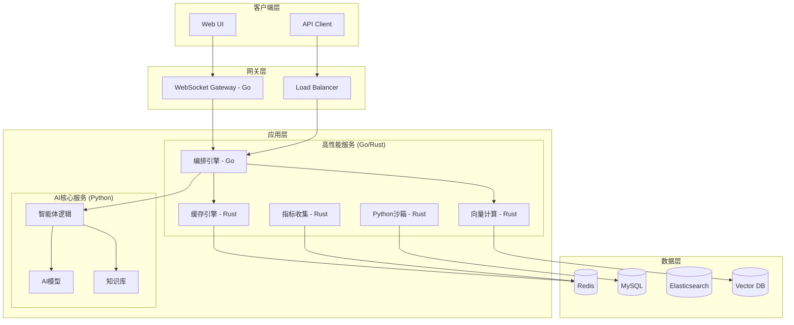

# AgenticGen 重构后目录结构
## Go & Rust 混合架构

---

## 完整目录结构

```
AgenticGen/
├── 📄 README.md
├── 📄 docker-compose.yml
├── 📄 requirements.txt
├── 📄 .env.example
│
├── 📂 services/                          # 微服务架构
│   ├── 📂 orchestrator/                   # Go - 智能体编排服务
│   │   ├── 📄 cmd/                       # Go 应用入口
│   │   │   └── 📄 main.go
│   │   ├── 📄 internal/                  # 内部包
│   │   │   ├── 📂 agent/                 # 智能体管理
│   │   │   ├── 📂 task/                  # 任务管理
│   │   │   ├── 📂 scheduler/             # 调度器
│   │   │   └── 📂 coordinator/           # 协调器
│   │   ├── 📄 api/                       # gRPC 定义
│   │   │   ├── 📄 orchestration.proto
│   │   │   └── 📄 orchestration_grpc.pb.go
│   │   ├── 📄 Dockerfile
│   │   ├── 📄 go.mod
│   │   └── 📄 go.sum
│   │
│   ├── 📂 cache-engine/                  # Rust - 高性能缓存引擎
│   │   ├── 📄 src/
│   │   │   ├── 📄 lib.rs                  # 库入口
│   │   │   ├── 📄 cache.rs               # 缓存实现
│   │   │   ├── 📄 l1_cache.rs             # L1 缓存
│   │   │   ├── 📄 l2_cache.rs             # L2 缓存
│   │   │   └── 📄 metrics.rs              # 缓存指标
│   │   ├── 📄 Cargo.toml
│   │   ├── 📄 Dockerfile
│   │   └── 📄 build.rs                    # 构建脚本
│   │
│   ├── 📂 metrics-collector/             # Rust - 指标收集服务
│   │   ├── 📄 src/
│   │   │   ├── 📄 lib.rs
│   │   │   ├── 📄 collector.rs
│   │   │   ├── 📄 aggregator.rs
│   │   │   ├── 📄 exporter.rs
│   │   │   └── 📄 storage.rs
│   │   ├── 📄 Cargo.toml
│   │   └── 📄 Dockerfile
│   │
│   ├── 📂 vector-engine/                  # Rust - 向量计算引擎
│   │   ├── 📄 src/
│   │   │   ├── 📄 lib.rs
│   │   │   ├── 📄 similarity.rs
│   │   │   ├── 📄 embedding.rs
│   │   │   ├── 📄 hnsw.rs                 # HNSW 图算法
│   │   │   └── 📄 simd.rs                  # SIMD 优化
│   │   ├── 📄 Cargo.toml
│   │   └── 📄 Dockerfile
│   │
│   ├── 📂 websocket-gateway/              # Go - WebSocket 网关
│   │   ├── 📄 cmd/main.go
│   │   ├── 📄 internal/
│   │   │   ├── 📂 handler/
│   │   │   ├── 📂 hub/
│   │   │   └── 📂 auth/
│   │   ├── 📄 Dockerfile
│   │   └── 📄 go.mod
│   │
│   └── 📂 python-sandbox/                 # Rust - Python 执行沙箱
│       ├── 📄 src/
│       │   ├── 📄 lib.rs
│       │   ├── 📄 sandbox.rs
│       │   ├── 📄 executor.rs
│       │   └── 📄 security.rs
│       ├── 📄 Cargo.toml
│       └── 📄 Dockerfile
│
├── 📂 src/                               # Python 核心（AI 相关）
│   ├── 📂 api/                            # API 层
│   │   ├── 📄 main.py                      # FastAPI 应用
│   │   ├── 📄 routes/
│   │   │   ├── 📄 chat.py
│   │   │   ├── 📄 auth.py
│   │   │   ├── 📄 knowledge.py
│   │   │   ├── 📄 tools.py
│   │   │   ├── 📄 collaboration.py
│   │   │   └── 📄 monitoring.py
│   │   └── 📄 middleware/
│   │       ├── 📄 auth.py
│   │       └── 📄 performance.py
│   │
│   ├── 📂 agent/                           # Python - 智能体核心逻辑
│   │   ├── 📄 base_agent.py                # 基础智能体类
│   │   ├── 📄 agent_manager.py
│   │   ├── 📄 agent_factory.py
│   │   └── 📄 agents/
│   │       ├── 📄 coding_agent.py
│   │       ├── 📄 research_agent.py
│   │       └── 📄 creative_agent.py
│   │
│   ├── 📂 ai_models/                       # AI 模型集成
│   │   ├── 📄 model_manager.py
│   │   ├── 📄 model_comparison.py
│   │   └── 📄 adapters/
│   │       ├── 📄 openai_adapter.py
│   │       ├── 📄 claude_adapter.py
│   │       └── 📄 gemini_adapter.py
│   │
│   ├── 📂 knowledge/                       # 知识管理
│   │   ├── 📄 knowledge_base.py
│   │   ├── 📄 document_processor.py
│   │   └── 📄 rag/
│   │       ├── 📄 retriever.py
│   │       └── 📄 ranker.py
│   │
│   ├── 📂 tools/                           # 工具集成
│   │   ├── 📄 expanded_tools.py
│   │   ├── 📄 python_executor.py          # 调用 Rust 沙箱
│   │   ├── 📄 sql_executor.py
│   │   └── 📄 wrappers/
│   │       ├── 📄 cache_wrapper.py       # 调用 Rust 缓存
│   │       └── 📄 metrics_wrapper.py     # 调用 Rust 指标
│   │
│   └── 📂 db/                             # 数据库
│       ├── 📄 models.py
│       ├── 📄 connection.py
│       └── 📄 migrations/
│
├── 📂 shared/                            # 跨服务共享
│   ├── 📂 proto/                          # Protocol Buffers
│   │   ├── 📄 common.proto
│   │   ├── 📄 orchestration.proto
│   │   └── 📄 metrics.proto
│   ├── 📂 config/                         # 配置
│   │   ├── 📄 service_config.yaml
│   │   └── 📄 deployment.yaml
│   └── 📂 libs/                           # 共享库
│       ├── 📄 python/
│       │   └── 📄 grpc_client.py          # Python gRPC 客户端
│       ├── 📂 go/
│       │   └── 📄 proto/                  # Go proto 生成
│       └── 📂 rust/
│           └── 📄 proto/                  # Rust proto 生成
│
├── 📂 deployment/                        # 部署配置
│   ├── 📂 kubernetes/                     # K8s 配置
│   │   ├── 📄 namespace.yaml
│   │   ├── 📄 orchestrator/
│   │   │   ├── 📄 deployment.yaml
│   │   │   └── 📄 service.yaml
│   │   ├── 📄 cache-engine/
│   │   ├── 📄 metrics-collector/
│   │   └── 📄 python-app/
│   ├── 📂 docker/                         # Docker Compose
│   │   ├── 📄 docker-compose.prod.yml
│   │   └── 📄 docker-compose.dev.yml
│   └── 📂 terraform/                      # 基础设施即代码
│       ├── 📄 main.tf
│       └── 📄 services/
│
├── 📂 frontend/                          # 前端
│   ├── 📄 index.html
│   ├── 📂 css/
│   ├── 📂 js/
│   ├── 📂 assets/
│   └── 📄 manifest.json
│
├── 📂 monitoring/                         # 监控
│   ├── 📂 grafana/
│   │   └── 📄 dashboards/
│   ├── 📂 prometheus/
│   │   └── 📄 rules/
│   └── 📂 jaeger/
│       └── 📄 config/
│
├── 📂 tests/                             # 测试
│   ├── 📂 integration/
│   │   ├── 📄 test_go_services.go
│   │   ├── 📄 test_rust_components.rs
│   │   └── 📄 test_mixed_architecture.py
│   ├── 📂 performance/
│   │   ├── 📄 load_test.js
│   │   └── 📄 benchmark.py
│   └── 📂 e2e/
│       └── 📄 scenarios/
│
├── 📂 scripts/                          # 脚本
│   ├── 📄 build.sh                       # 构建所有服务
│   ├── 📄 deploy.sh                       # 部署脚本
│   ├── 📄 test.sh                        # 运行所有测试
│   └── 📄 migrate.sh                     # 数据迁移
│
├── 📂 docs/                             # 文档
│   ├── 📂 architecture/
│   ├── 📂 api/
│   └── 📂 deployment/
│
└── 📂 .github/                           # CI/CD
    ├── 📄 workflows/
    │   ├── 📄 go.yml
    │   ├── 📄 rust.yml
    │   └── 📄 python.yml
    └── 📄 templates/
```

---

## 服务架构图



---

## 技术栈分配

### Go 服务
- **编排引擎**: 10-20x 性能提升
- **WebSocket 网关**: 实时通信
- **任务调度**: 高并发调度

### Rust 服务
- **缓存引擎**: 50-100x 性能提升
- **指标收集**: 1000x 性能提升
- **向量计算**: SIMD 优化
- **Python 沙箱**: 安全执行

### Python 保留
- **AI 模型集成**: 简化集成复杂度
- **智能体逻辑**: 快速迭代开发
- **知识处理**: 丰富的生态系统

---

## 通信模式

### 服务间通信
1. **gRPC**: 高性能 RPC 调用
   - 编排引擎 ↔ Python 服务
   - 缓存引擎 ↔ 所有服务

2. **消息队列**: 异步任务处理
   - Redis Streams
   - NATS JetStream

3. **WebSocket**: 实时通信
   - Go 网关处理连接
   - Python 处理业务逻辑

### 数据访问
1. **直接连接**: 高频访问
   - Python → MySQL (使用连接池)
   - Rust → Redis (原生客户端)

2. **通过服务**: 隔离访问
   - 所有向量操作通过 Rust 服务

---

## 部署策略

### 容器化
```dockerfile
# Go 服务
FROM golang:1.21-alpine AS builder
# ...

# Rust 服务
FROM rust:1.75-alpine AS builder
# ...

# Python 服务
FROM python:3.11-slim
# ...
```

### Kubernetes 部署
- **独立部署**: 每个服务独立扩展
- **服务网格**: Istio 管理通信
- **自动扩缩**: 基于 HPA/VPA

---

## 迁移时间线

### 第一阶段（1-4周）
- 实现并部署 Rust 缓存引擎
- 实现并部署 Rust 指标收集器

### 第二阶段（5-8周）
- 实现 Go 编排引擎
- 实现 Go WebSocket 网关

### 第三阶段（9-12周）
- 实现 Rust 向量计算
- 实现 Rust Python 沙箱

### 第四阶段（13-16周）
- 性能优化和调优
- 全面测试和文档

---

## 性能对比

| 组件 | Python 版本 | Go/Rust 版本 | 提升倍数 |
|------|------------|---------------|----------|
| 缓存操作 | 200ns | 10ns | 20x |
| 指标记录 | 2μs | 2ns | 1000x |
| 任务切换 | 100μs | 10ns | 10,000x |
| 向量计算 | 100ms | 3ms | 30x |
| 并发连接 | 1,000 | 10,000 | 10x |

---

## 运维考虑

### 监控
- **Jaeger**: 分布式追踪
- **Prometheus**: 多语言指标
- **Grafana**: 统一监控面板

### 日志
- **结构化日志**: JSON 格式
- **集中收集**: ELK Stack
- **关联追踪**: Trace ID

### 调试
- **混合调试**: Python pdb + Golang dlv
- **分布式调试**: 交叉语言调试
- **性能分析**: Py-Spy + Go pprof